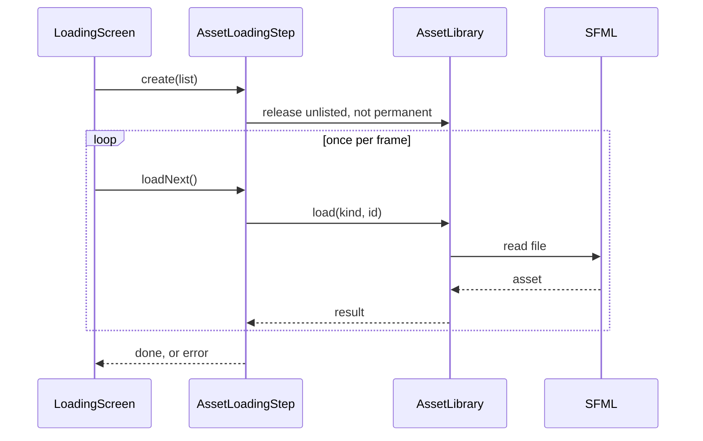
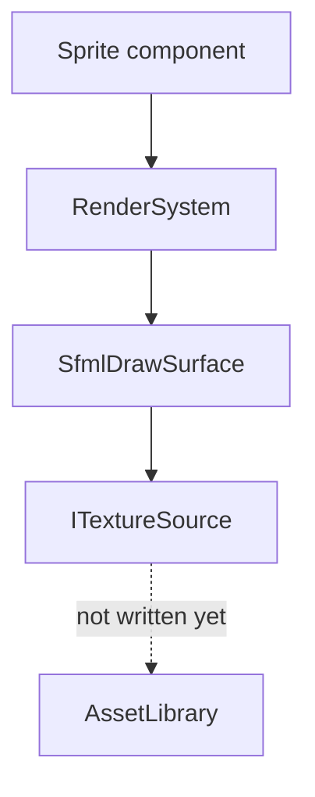

The client, `r-type_client` (`src/client/`), shows the game, plays its sounds and reads the player's input; the server decides what happens in the match (see [Architecture](/R-Type/architecture/)). Today it finds its assets folder, loads the assets of its interface, opens a window and runs its screens: a loading screen, the game screen, which shows an empty playfield, and an options screen. It does not talk to the server yet.

This page tells you where to look when you need to change something. It describes what exists today and says plainly what does not exist yet.

| Part | State | Where |
|---|---|---|
| Window | Available | `src/client/Window/` |
| Frame loop and screen stack | Available | `src/client/Application/` |
| Screens | Available: loading, game and options; the menus are not written yet | `src/client/Screens/` |
| Assets folder and asset ids | Available | `src/client/Assets/`, `assets/README.md` |
| Asset loading | Available; used at launch for the interface assets, and by the loading screen | `src/client/Assets/AssetLibrary/`, `src/client/Assets/AssetLoadingStep/` |
| Path of the running executable | Available | `src/client/Platform/` |
| Drawing entities | Available; not called by the game screen yet | `src/client/Rendering/` |
| Sprites, sounds and music of the game | Not yet written | — |

## Frame loop and screens: `Application`, `ScreenStack`

`Application` (`src/client/Application/Application/`) opens the window, `GameWindow`, and runs the frame loop until the window is closed or no screen is left. A screen implements `IScreen` (`src/client/Screens/`): `handleEvent()`, `update()` and `draw()`, in playfield units. Screens live in a `ScreenStack` (`src/client/Application/ScreenStack/`). Each frame, the window events go to the screen on top only, then every screen is updated and drawn from the bottom up, so a screen pushed over the game leaves the game running and visible behind it. `GameWindow` handles closing and resizing itself and never passes those events on.

`push()`, `pop()` and `replaceAll()` only ask for a change; the loop applies the changes after each event and after the update, in the order they were asked for. A screen may therefore pop itself while it handles an event, and the next event already reaches the new screen on top. A screen is given as a `ScreenFactory` and built when its change is applied: `replaceAll()` destroys every screen, from the top down, before building the new one. The loading screen releases assets when it is built, so it is always entered through `replaceAll()`, never pushed over a screen that still draws them.

| Screen | Shows | Leaves the stack when |
|---|---|---|
| `LoadingScreen` | a progress bar; one file is loaded per frame | every file is loaded: it replaces every screen with the next one |
| `GameScreen` | the playfield background; releasing `OPTIONS_KEY` (Escape) pushes the options over it | not yet: the end of a game is not written |
| `OptionsScreen` | the window size buttons, on a translucent layer over the game | `OPTIONS_KEY` is released again |

The game screen and the options screen are **provisional**: the background color, `PLAYFIELD_BACKGROUND_COLOR` (`src/client/Screens/ScreenColors.hpp`), stands in for the scrolling background, and the options screen for the options menu. At launch the client enters a game straight away: the loading screen loads `gameAssets()`, then gives way to the game screen. A file the loading screen cannot load stops the client with exit code 1, naming every such file. The options react to the release of `OPTIONS_KEY`, not to its press: the system repeats the press of a held key, which would open and close them again and again.

## Assets: the folder and the ids

Every file the client reads at run time sits in `assets/`, at the root of the repository. At launch, `locateAssetFolder()` (`rtype_client_assets`) looks for `assets/` next to the executable, then in the folder above it, where the Visual Studio generator writes `Release/` and `Debug/`. The folder the client was launched from plays no part. When neither folder exists, the client stops with exit code 1 and an `AssetFolderNotFoundException` naming both folders it searched.

Code names a file by its **asset id**: its path in `assets/`, with `/` between folders, for example `sprites/player_ship.png`. Every folder and file name of an id starts with a lowercase letter or a digit, then holds only `a-z`, digits, `_`, `-` and `.`; `isValidAssetId()` checks it. An id is therefore spelled the same on every system and never names a file outside `assets/`, and a later mod folder can replace a file by holding the same path. Ids are written once, as named constants.

## Assets: loading

`AssetLibrary` (`rtype_client_asset_library`) owns every loaded asset. `load(kind, id)` reads a texture, a sound or a font the first time only, and only locates a music file, which is streamed while it plays. It never throws: it returns an `AssetLoadResult` (`Loaded`, `InvalidId`, `MissingFile`, `UnreadableFile`). Its lookups, `texture()`, `sound()`, `font()` and `musicFile()`, never read the disk; an id that is not loaded throws `AssetNotLoadedException`. `keepPermanently()` makes assets permanent: no release drops them. A reference stays valid until its asset is released, so a sprite, which keeps a reference to its texture, must be gone before its texture is released.

`AssetLoadingStep` (`rtype_client_asset_loading_step`) loads an `AssetList`. When it is created, it releases every loaded asset the list does not name, except the permanent ones, so whatever still uses them must already be destroyed; the assets already loaded are neither read again nor counted. Then `loadNext()` loads one asset per call, so a loading screen can be drawn between two files. After the last asset, if any could not be loaded, it throws one `AssetLoadingException` naming every invalid id, missing file and unreadable file.

Assets are loaded at two moments only, both declared in `src/client/Screens/ScreenAssets.hpp` and listed in `ScreenAssets.cpp`:

- at launch, before the window opens, `loadInterfaceAssets()` loads `interfaceAssets()`, the assets of the interface, which any screen may use at any time, in a game or outside one (today the font of the options screen, `INTERFACE_FONT_ID`, `fonts/tuffy.ttf`), and makes them permanent, so changing screen outside a game never reads a file;
- when the player enters a game, the loading screen loads `gameAssets()`, one file per frame, after releasing what a previous game used and this one does not. `gameAssets()` is empty today, since the game has no sprite yet: the loading screen finishes at its first frame and is never seen.

### What a loading step does

The loading screen creates the step, then calls `loadNext()` once per frame until `isFinished()`, drawing the progress in between. At launch, `loadInterfaceAssets()` runs a step to its end at once, before the window opens.

## Assets in the game: from an entity to the screen

The engine knows nothing about assets, and the game only names them: an entity that is drawn carries a `Sprite` component (`rtype_game`) holding an asset id and a layer, so the server can say what an entity looks like without SFML. Each frame, `RenderSystem` (`src/client/Rendering/`) walks the entities that have a `Position` and a `Sprite`, layer by layer, and asks an `IDrawSurface` to draw each asset id at its position. `SfmlDrawSurface` turns the id into a texture through `ITextureSource`; an id with no texture is skipped and logged once.

Two links do not exist yet: no `ITextureSource` reads from `AssetLibrary`, and the game screen does not call `RenderSystem`. Once they do, showing a new image takes four steps:

1. Put the file in `assets/sprites/`, named after the asset id rule.
2. Write its id once, as a named constant.
3. List the id in `gameAssets()`.
4. Give the entity a `Sprite` with that id and its layer.

## Platform: the executable path

`executablePath()` (`src/client/Platform/`) returns the path of the running executable, or nothing when the system does not tell. Each system has its own source file, `ExecutablePathLinux.cpp`, `ExecutablePathMacOs.cpp` and `ExecutablePathWindows.cpp`, and CMake builds only the one that matches.

## Where to intervene

| You want to… | Look at |
|---|---|
| Add an asset | A file in `assets/sprites/`, `sounds/`, `music/` or `fonts/`, and its id in `gameAssets()`, or in `interfaceAssets()` when a screen may use it outside a game, menus and overlays included (`src/client/Screens/ScreenAssets.cpp`) |
| Change the asset id rule | `isValidAssetId()` in `src/client/Assets/AssetIds.cpp`, `ASSET_ID_PUNCTUATION` in `AssetConstants.hpp`, and `assets/README.md` |
| Change where the client looks for `assets/` | `findAssetFolder()` in `src/client/Assets/AssetFolder.cpp` |
| Show a new image in the game | `assets/sprites/`, `gameAssets()`, a `Sprite` component on the entity |
| Add a screen | A class implementing `IScreen` in its own folder under `src/client/Screens/`, with its `CMakeLists.txt` target; `add_subdirectory` in `src/client/Screens/CMakeLists.txt`; the factory that builds it in `Application`, and the link in `src/client/Application/Application/CMakeLists.txt` |
| Load a new kind of asset | `AssetKind`, `AssetList` and `AssetLibrary::load()` |
| Change what happens when an asset cannot be loaded | `AssetLoadingStep::loadNext()` and `AssetLoadingException` in `src/client/Exceptions/ClientException.hpp` |
| Read something only one system provides | A declaration in `src/client/Platform/`, one source file per system, chosen in its `CMakeLists.txt` |
