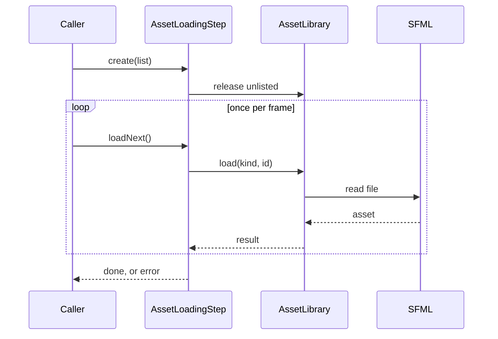
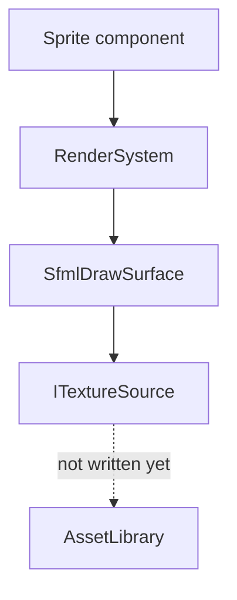

The client, `r-type_client` (`src/client/`), shows the game, plays its sounds and reads the player's input; the server decides what happens in the match (see [Architecture](/R-Type/architecture/)). Today it opens a window, finds its assets folder at launch and can load the assets of a screen. The screens themselves do not exist yet.

This page tells you where to look when you need to change something. It describes what exists today and says plainly what does not exist yet.

| Part | State | Where |
|---|---|---|
| Window and frame loop | Available | `src/client/Window/` |
| Assets folder and asset ids | Available | `src/client/Assets/`, `assets/README.md` |
| Asset loading | Available; used at launch for the font of the window size buttons | `src/client/Assets/AssetLibrary/`, `src/client/Assets/AssetLoadingStep/` |
| Path of the running executable | Available | `src/client/Platform/` |
| Drawing entities | Available; not called by the frame loop yet | `src/client/Rendering/` |
| Screens and the loading screen | Not yet written | — |
| Sprites, sounds and music of the game | Not yet written | — |

## Assets: the folder and the ids

Every file the client reads at run time sits in `assets/`, at the root of the repository. At launch, `locateAssetFolder()` (`rtype_client_assets`) looks for `assets/` next to the executable, then in the folder above it, where the Visual Studio generator writes `Release/` and `Debug/`. The folder the client was launched from plays no part. When neither folder exists, the client stops with exit code 1 and an `AssetFolderNotFoundException` naming both folders it searched.

Code names a file by its **asset id**: its path in `assets/`, with `/` between folders, for example `sprites/player_ship.png`. Every folder and file name of an id starts with a lowercase letter or a digit, then holds only `a-z`, digits, `_`, `-` and `.`; `isValidAssetId()` checks it. An id is therefore spelled the same on every system and never names a file outside `assets/`, and a later mod folder can replace a file by holding the same path. Ids are written once, as named constants.

## Assets: loading per screen

`AssetLibrary` (`rtype_client_asset_library`) owns every loaded asset. `load(kind, id)` reads a texture, a sound or a font the first time only, and only locates a music file, which is streamed while it plays. It never throws: it returns an `AssetLoadResult` (`Loaded`, `InvalidId`, `MissingFile`, `UnreadableFile`). Its lookups, `texture()`, `sound()`, `font()` and `musicFile()`, never read the disk; an id that is not loaded throws `AssetNotLoadedException`. A reference stays valid until its asset is released, so a sprite, which keeps a reference to its texture, must be gone before its texture is released.

`AssetLoadingStep` (`rtype_client_asset_loading_step`) loads the `AssetList` of the next screen. It is built once the previous screen is destroyed: it releases every loaded asset the list does not name, keeps the ones both screens use, then `loadNext()` loads one asset per call, so a loading screen can be drawn between two files. After the last asset, it throws one `AssetLoadingException` naming every invalid id, missing file and unreadable file.

```cpp
rtype::client::AssetLoadingStep loading(
    assets, rtype::client::AssetList{.textures = {PLAYER_SHIP_TEXTURE},
                                     .sounds = {SHOT_SOUND}});
while (!loading.isFinished()) {
  loading.loadNext();
  drawLoadingScreen(loading.processedCount(), loading.assetCount());
}
const sf::Texture& ship = assets.texture(PLAYER_SHIP_TEXTURE);
```

`PLAYER_SHIP_TEXTURE`, `SHOT_SOUND` and `drawLoadingScreen` stand for an id constant and a loading screen that do not exist yet.

### What a loading step does

The caller creates the step, then calls `loadNext()` once per frame until `isFinished()`, drawing the progress in between. Today the caller is `main`, which runs one step at launch, before the window opens, for the font of the window size buttons. Once screens exist, the screen stack will run one step at every screen change.



## Assets in the game: from an entity to the screen

The engine knows nothing about assets, and the game only names them: an entity that is drawn carries a `Sprite` component (`rtype_game`) holding an asset id and a layer, so the server can say what an entity looks like without SFML. Each frame, `RenderSystem` (`src/client/Rendering/`) walks the entities that have a `Position` and a `Sprite`, layer by layer, and asks an `IDrawSurface` to draw each asset id at its position. `SfmlDrawSurface` turns the id into a texture through `ITextureSource`; an id with no texture is skipped and logged once.



Two links do not exist yet: no `ITextureSource` reads from `AssetLibrary`, and the frame loop does not call `RenderSystem`. Once they do, showing a new image takes four steps:

1. Put the file in `assets/sprites/`, named after the asset id rule.
2. Write its id once, as a named constant.
3. List the id in the `AssetList` of every screen that draws it.
4. Give the entity a `Sprite` with that id and its layer.

## Platform: the executable path

`executablePath()` (`src/client/Platform/`) returns the path of the running executable, or nothing when the system does not tell. Each system has its own source file, `ExecutablePathLinux.cpp`, `ExecutablePathMacOs.cpp` and `ExecutablePathWindows.cpp`, and CMake builds only the one that matches.

## Where to intervene

| You want to… | Look at |
|---|---|
| Add an asset | A file in `assets/sprites/`, `sounds/`, `music/` or `fonts/`, and its id in the asset list of the screen that uses it |
| Change the asset id rule | `isValidAssetId()` in `src/client/Assets/AssetIds.cpp`, `ASSET_ID_PUNCTUATION` in `AssetConstants.hpp`, and `assets/README.md` |
| Change where the client looks for `assets/` | `findAssetFolder()` in `src/client/Assets/AssetFolder.cpp` |
| Show a new image in the game | `assets/sprites/`, the `AssetList` of the screen, a `Sprite` component on the entity |
| Load a new kind of asset | `AssetKind`, `AssetList` and `AssetLibrary::load()` |
| Change what happens when an asset cannot be loaded | `AssetLoadingStep::loadNext()` and `AssetLoadingException` in `src/client/Exceptions/ClientException.hpp` |
| Read something only one system provides | A declaration in `src/client/Platform/`, one source file per system, chosen in its `CMakeLists.txt` |
