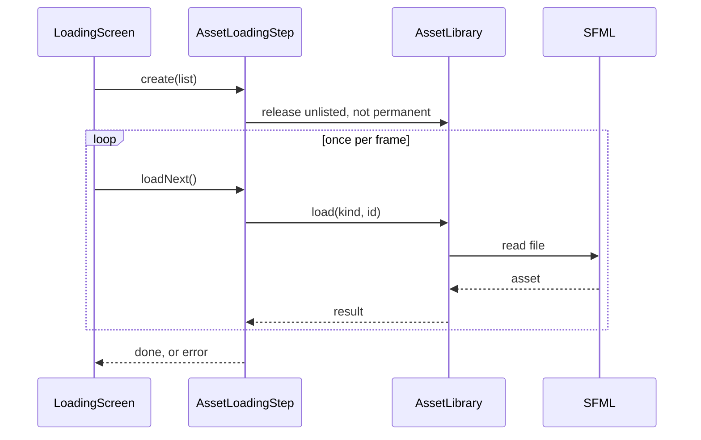
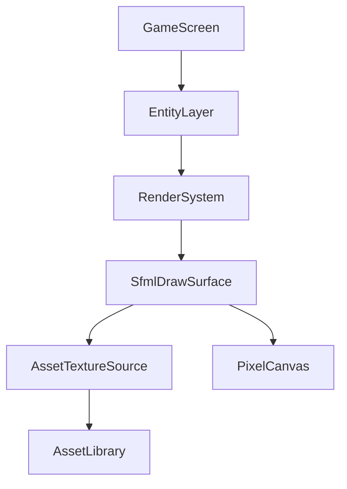

The client, `r-type_client` (`src/client/`), shows the game, plays its sounds and reads the player's input; the server decides what happens in the match (see [Architecture](/R-Type/architecture/)). Today it finds its assets folder, loads the assets of its interface, opens a window and runs its screens over a scrolling starfield: the title screen it opens on, a connection screen, a waiting room, a loading screen, the game screen, which draws the entities the server announces from one sprite sheet, animated, and their effects from another, on a ladder of intensity from a shot to a ship destroyed, and opens each game with MISSION START, an options screen and a quit confirmation, the menus all built from the same widgets. The game screen reads the player's actions through the keys the player chose, the arrows and the space bar at first; the options change them, with the volumes, the window size and the accessibility settings, and save them in a file for the next launch. It reads the server's address and port and the player's nickname at launch, shows them on its connection screen, and joins the server from there: it sends the connection request of the protocol, on a network thread opened at launch, until the server accepts or refuses it. Once accepted, it opens a waiting room that lists the players of the server and where the player says it is ready, then the game when the server announces its start, where the ships and Bydos appear, move and disappear as the server says, over a status band that shows the nickname, the lives and the score of each pilot.

This page tells you where to look when you need to change something. It describes what exists today and says plainly what does not exist yet.

| Part | State | Where |
|---|---|---|
| Window | Available | `src/client/Window/` |
| Frame loop and screen stack | Available | `src/client/Application/` |
| Screens | Available: title, connection, waiting room, loading, game, options and quit confirmation | `src/client/Screens/` |
| Menu widgets and their builder | Available; used by the title, the connection screen, the waiting room, the options and the quit confirmation | `src/client/Widgets/` |
| Text field | Available; used by the connection screen | `src/client/Widgets/TextField/` |
| Controls of a row: slider, switch, selector, list, key slot, link | Available; used by the options | `src/client/Widgets/RowControls/` |
| Assets folder and asset ids | Available | `src/client/Assets/`, `assets/README.md` |
| Asset loading | Available; used at launch for the interface assets, and by the loading screen | `src/client/Assets/AssetLibrary/`, `src/client/Assets/AssetLoadingStep/` |
| Path of the running executable, the reduced motion setting of the system, the settings folder | Available | `src/client/Platform/` |
| Player settings and their file | Available; the game reads the flashes setting; the volumes, the color mode, the sound cues and auto-fire are saved, but nothing reads them yet | `src/client/Settings/` |
| Drawing entities | Available; drawn by the game screen | `src/client/Rendering/Drawing/EntityLayer/`, `src/client/Rendering/Drawing/RenderSystem/`, `src/client/Rendering/Drawing/SfmlDrawSurface/`, `src/client/Rendering/Sprites/AssetTextureSource/` |
| Sprites of the ships, Bydos and missiles | Available, animated | `assets/sprites/entities.png`, `src/client/Rendering/Sprites/EntitySprites.cpp` |
| Animations | Available; played by the game screen | `src/client/Rendering/Sprites/Animation/`, `src/client/Rendering/Sprites/AnimationSystem/` |
| Effects: explosions, impacts, muzzle flashes, hit flashes, debris, shockwaves, camera shake, figures of gains, arrivals, invulnerability | Available; played when the server says an entity was killed or hit, when a missile or a ship appears, and when a world state says a ship cannot be hit; the server runs no collision yet and sends every ship as vulnerable, so in a game only the arrivals show | `assets/sprites/effects.png`, `src/client/Rendering/Effects/`, `src/client/Rendering/SpriteLook/HitFlashSystem/` |
| MISSION START: the warp of the stars and the banner | Available; played by the game screen at the start of each game | `src/client/Rendering/Effects/MissionStart/MissionStart.cpp`, `src/client/Widgets/MissionBanner.cpp` |
| Scrolling background | Available; drawn by the frame loop under every screen | `src/client/Rendering/Background/` |
| Pictures of the menus, pixel fonts | Available | `src/client/Rendering/Interface/InterfaceCanvas/`, `assets/fonts/` |
| Squadron of the title screen | Available | `src/client/Rendering/Interface/Squadron/` |
| Player commands | Available; read by the game screen, which sends them to the server | `src/client/Input/` |
| Key remapping | Available; set in the options, read by the game screen and the waiting room | `src/client/Input/` |
| Network thread | Available; opened at launch | `src/client/Connection/NetworkThread/` |
| Ignoring an old world state | Available; used by `EntityReplicator` | `src/client/Replication/WorldStateFilter/` |
| Applying the entities the server announces | Available; used by the game screen | `src/client/Replication/EntityReplicator/` |
| Status band of the game: nickname, lives and score of each pilot | Available; the server sends the real score but counts no lives yet, and the client does not decode `PlayerLeft` | `src/client/Widgets/StatusBand.cpp`, `src/client/Replication/ScoreBoard/`, `assets/sprites/hud.png` |
| Server address, port and nickname at launch | Available; they fill the connection screen | `src/client/LaunchOptions/` |
| Joining a server | Available: request, challenge, acceptance or refusal, then the waiting room, the ready state, the start of the game, the entity messages and the game events of the game, and leaving | `src/client/Connection/ServerConnection/` |
| Sounds and music of the game | Not yet written | — |

## Frame loop and screens: `Application`, `ScreenStack`

`Application` (`src/client/Application/Application/`) opens the window, `GameWindow`, and runs the frame loop until the window is closed or no screen is left. A screen implements `IScreen` (`src/client/Screens/`): `handleEvent()`, `update(elapsed)`, `draw()`, in playfield units, and `hidesScreensBelow()`; `elapsed` is the real time since the previous frame, the same for every screen and for the scrolling background. Screens live in a `ScreenStack` (`src/client/Application/ScreenStack/`). Each frame, the window events go to the screen on top only, then every screen is updated, so a screen pushed over the game leaves the game running behind it. Screens are drawn from the bottom up, starting at the topmost screen whose `hidesScreensBelow()` is true: the screens under it are updated but not drawn, and they receive no event, so a click on the options never reaches a button of the title. The title, the connection screen, the waiting room, the loading screen, the game and the options over the title hide the screens below; the quit confirmation and the options over a game do not, so the screen under them shows through their dimmed layer. `GameWindow` handles closing and resizing itself and never passes those events on.

Screens are asked for by identifier: `push()` and `replaceAll()` take a `ScreenId` (`src/client/Screens/ScreenId.hpp`), so a screen never builds the screens it opens. `Application::createScreen()` is the one list of every screen, a `switch` with one case per `ScreenId`; a value without a case does not compile. `push()`, `pop()`, `replaceAll()` and `closeAll()` only ask for a change; the loop applies the changes after each event and after the update, in the order they were asked for. A screen may therefore pop itself while it handles an event, and the next event already reaches the new screen on top. A screen sees the stack only as an `IScreenNavigator` (`src/client/Screens/IScreenNavigator.hpp`), which holds `push()`, `pop()`, `replaceAll()` and `closeAll()` and nothing else: applying the changes, updating, drawing and handing out events stay with the frame loop, so no screen can break this order. A screen is built when its change is applied: `replaceAll()` destroys every screen, from the top down, before building the new one; `closeAll()` destroys them all and builds none, so the frame loop stops and the client closes. Building the game, or its loading screen, releases the assets of a previous game, so `ScreenId::Game` is always entered through `replaceAll()`, never pushed over a screen that still draws them.

| Screen | Shows | Leaves the stack when |
|---|---|---|
| `TitleScreen` | the logo, PLAY, SETTINGS and QUIT, and the squadron, over the scrolling background; PLAY pushes the connection screen over it | the waiting room asks `replaceAll(ScreenId::Game)` |
| `ConnectionScreen` | over the title, which it hides: a form centered on the picture, DIRECT CONNECT, the fields ADDRESS, PORT and PILOT, CONNECT and BACK, then a status line | BACK or Escape drops the attempt and closes it; once the server has accepted the player for `ACCEPTED_STATUS_DURATION` (1 s), it pushes the waiting room over it (`ScreenId::Lobby`), and leaves with it when the game starts |
| `LobbyScreen` | over the connection screen, which it hides: WAITING ROOM, the number of pilots, a bay per player number, READY and the status line, BACK in the corner (see [Waiting room](#waiting-room-lobbyscreen)) | BACK or Escape leaves the server and closes it; once the connection learns that the game started, it asks `replaceAll(ScreenId::Game)` |
| `LoadingScreen` | a progress bar; one file is loaded per frame | every file is loaded: it asks again, with `replaceAll()`, for the screen it loads for, which `createScreen()` now builds itself |
| `GameScreen` | the entities the server announces, animated, and their effects, over the scrolling background; releasing `OPTIONS_KEY` (Escape) releases what the player holds and pushes the options over it (`ScreenId::GameOptions`) | not yet: the end of a game is not written |
| `OptionsScreen` | over the title, which it hides (`ScreenId::Options`), or over the game, which goes on running behind it, dimmed (`ScreenId::GameOptions`): SETTINGS, the tabs SOUND, CONTROLS, DISPLAY and ACCESS, a panel of rows, then BACK (see [Options](/R-Type/client/#options-optionsscreen)) | BACK, or Escape (`MENU_CANCEL_KEY`) once no list is open and no key is awaited, closes it |
| `QuitConfirmationScreen` | over the title, still drawn under a dimmed layer, a panel: ARE YOU SURE YOU WANT TO QUIT?, NO selected | NO or Escape closes it; YES asks `closeAll()`, which closes the client |

The frame loop draws the scrolling background under every screen, the loading screen and the options included, even when they hide the screens below; this is **provisional**, since the starfield will probably become the background of the game screen alone. At launch the client opens on the title screen, with `replaceAll(ScreenId::Title)`; PLAY pushes the connection screen, which pushes the waiting room once a connection is accepted; the waiting room asks for the game with `replaceAll(ScreenId::Game)` once the server announces its start: the loading screen of `gameAssets()` while some are not loaded, then the game screen. A file the loading screen cannot load stops the client with exit code 1, naming every such file. The game opens the options on the release of `OPTIONS_KEY`, not on its press: the system repeats the press of a held key, which would open and close them again and again. Menus act on releases for the same reason (see [Menus](#menus-menubuilder-menu)).

## Assets: the folder and the ids

Every file the client reads at run time sits in `assets/`, at the root of the repository. At launch, `locateAssetFolder()` (`rtype_client_assets`) looks for `assets/` next to the executable, then in the folder above it, where the Visual Studio generator writes `Release/` and `Debug/`. The folder the client was launched from plays no part. When neither folder exists, the client stops with exit code 1 and an `AssetFolderNotFoundException` naming both folders it searched.

Code names a file by its **asset id**: its path in `assets/`, with `/` between folders, for example `sprites/player_ship.png`. Every folder and file name of an id starts with a lowercase letter or a digit, then holds only `a-z`, digits, `_`, `-` and `.`; `isValidAssetId()` checks it. An id is therefore spelled the same on every system and never names a file outside `assets/`, and a later mod folder can replace a file by holding the same path. Ids are written once, as named constants.

## Assets: loading

`AssetLibrary` (`rtype_client_asset_library`) owns every loaded asset. `load(kind, id)` reads a texture, a sound or a font the first time only, and only locates a music file, which is streamed while it plays. It never throws: it returns an `AssetLoadResult` (`Loaded`, `InvalidId`, `MissingFile`, `UnreadableFile`). Its lookups, `texture()`, `sound()`, `font()` and `musicFile()`, never read the disk; an id that is not loaded throws `AssetNotLoadedException`. `keepPermanently()` makes assets permanent: no release drops them. A reference stays valid until its asset is released, so a sprite, which keeps a reference to its texture, must be gone before its texture is released.

`AssetLoadingStep` (`rtype_client_asset_loading_step`) loads an `AssetList`. When it is created, it releases every loaded asset the list does not name, except the permanent ones, so whatever still uses them must already be destroyed; the assets already loaded are neither read again nor counted. Then `loadNext()` loads one asset per call, so a loading screen can be drawn between two files. After the last asset, if any could not be loaded, it throws one `AssetLoadingException` naming every invalid id, missing file and unreadable file.

Assets are loaded at three moments only, all declared in `src/client/Screens/ScreenAssets.hpp` and listed in `ScreenAssets.cpp`:

- at launch, before the window opens, `loadInterfaceAssets()` loads `interfaceAssets()`, the assets of the interface, which any screen may use at any time, in a game or outside one (today the two pixel fonts of the menus, `REGULAR_FONT_ID` and `SMALL_FONT_ID`), and makes them permanent, so changing screen outside a game never reads a font;
- right after, still before the window opens, `loadTitleAssets()` loads `titleAssets()`: the logo (`LOGO_ID`, `sprites/logo.png`) and the entity sheet the squadron is drawn from, so the first frame already shows the title. They are not permanent: entering a game releases the logo, and a title screen built later goes through the loading screen of `titleAssets()` when one is missing;
- when the player enters a game (`ScreenId::Game`), the loading screen loads `gameAssets()`, one file per frame, after releasing what a previous game used and this one does not. When they are all loaded already, the game screen is built at once, after the same release. Today `gameAssets()` holds the entity sheet (`ENTITY_SHEET_ID`), which the title already loaded, and three files it does not: the effect sheet (`EFFECT_SHEET_ID`), and the HUD sheet (`HUD_SHEET_ID`) and the plug icon (`PLUG_ICON_ID`) of the status band. The waiting room asks for the game during its update, so the loading screen is built after the update of that frame and drawn once, its bar empty; in each of the next three frames it loads one file, and it is drawn after the first two; after the third, the game screen replaces it before the draw. Entering a game therefore shows the loading screen for three frames, 50 ms at `FRAMES_PER_SECOND_LIMIT` (60).

### What a loading step does

The loading screen creates the step, then calls `loadNext()` once per frame until `isFinished()`, drawing the progress in between. At launch, `loadInterfaceAssets()` runs a step to its end at once, before the window opens.


```mermaid
sequenceDiagram
  accTitle: Loading the assets of a game
  accDescr: The loading screen creates a loading step with the asset list of the game. The step asks the asset library to release what the list does not name, except the permanent assets. Then, once per frame, the loading screen asks the step for the next asset of the list that was not loaded when the step was created; the step asks the library to load it, the library reads the file with SFML, and returns how it went. After the last asset the step is finished, or throws one error naming every problem.
  participant Screen as LoadingScreen
  participant Step as AssetLoadingStep
  participant Library as AssetLibrary
  participant Sfml as SFML
  Screen->>Step: create(list)
  Step->>Library: release unlisted, not permanent
  loop once per frame
    Screen->>Step: loadNext()
    Step->>Library: load(kind, id)
    Library->>Sfml: read file
    Sfml-->>Library: asset
    Library-->>Step: result
  end
  Step-->>Screen: done, or error
```

## Assets in the game: from an entity to the screen

The engine knows nothing about assets, and the game only names them: an entity that is drawn carries a `Sprite` component (`rtype_game`) holding an asset id, the rectangle of that image to show (`SpriteFrame`, in pixels of the image) and a layer. Each frame, `RenderSystem` (`src/client/Rendering/Drawing/`) walks the entities that have a `Position` and a `Sprite`, and those that have a `Position` and a visible `Caption`, a line of text, layer by layer (see [Drawing order](#drawing-order-layer)). It asks an `IDrawSurface` to draw each rectangle as a `SpriteDrawing` (the image, the rectangle, its center, its `SpriteTone` and an outline) and to write each line. What the effects change about an entity, its tone, a few pixels of offset or the rows it shows, comes from its components (see [Effects on sprites](#effects-on-sprites-nudge-reveal-invulnerability-caption)). `SfmlDrawSurface` finds the texture through `ITextureSource`, which `AssetTextureSource` reads from the `AssetLibrary` without loading anything; an id with no loaded texture is skipped and logged once.

`SfmlDrawSurface` paints on a `PixelCanvas`, the pixel grid of the sky (see [How it is drawn](#how-it-is-drawn)): a position becomes a pixel of the canvas, which covers `BACKGROUND_PIXEL_SIZE` (4) logical units, and each rectangle lands on whole pixels, so a sprite is copied pixel for pixel and its pixels match the stars at every window size. An entity therefore moves on screen by whole background pixels, 4 logical units at a time. A line is written by the `TextWriter` of the layer (`rtype_client_text_writer`, `src/client/Rendering/Interface/TextWriter/`), the code that writes the text of the menus too (see [How a menu is drawn](#how-a-menu-is-drawn-interfacecanvas)).

The canvas belongs to `EntityLayer` (`src/client/Rendering/Drawing/EntityLayer/`), behind the `IEntityLayer` interface. The game screen owns the entities of the game, which appear and disappear with it, and an entity layer. It paints the layer at construction and at the end of every `update()`, once the animations and effects of the frame have moved (see [Animations](#animations-animation-animationsystem)): the layer clears its canvas to transparent, paints the pixel effects (see [Pixel effects](#pixel-effects-pixeleffects-paintgroundeffects)), lets `RenderSystem` paint on it, all shifted by the shake of the camera, and ends the picture. In `draw()` it only lays the layer, then the status band (see [Status band](#status-band-scoreboard-paintstatusband)), since `draw()` is const; the entities sit over the background and under any screen pushed over the game. `GameScreen` sees only `IEntityLayer`, so `client_screen_tests` gives it a recording double and needs no graphics card.


```mermaid
flowchart TB
  accTitle: From the game screen to the screen
  accDescr: The game screen asks its entity layer to paint its entities. The layer runs RenderSystem, which passes each sprite to SfmlDrawSurface; the surface finds the texture through AssetTextureSource, reading the asset library, and paints the rectangle on the pixel canvas, which the layer lays over the sky.
  Game[GameScreen] --> Layer[EntityLayer]
  Layer --> Render[RenderSystem]
  Render --> Surface[SfmlDrawSurface]
  Surface --> Source[AssetTextureSource]
  Source --> Library[AssetLibrary]
  Surface --> Canvas[PixelCanvas]
```

Showing a new image takes four steps:

1. Draw it at its native size into `assets/sprites/entities.png`, or put a new file in `assets/sprites/`, named after the asset id rule.
2. Write its rectangle once, as a named constant (`EntitySpriteConstants.hpp` for the entity sheet), and the id of a new file too.
3. List the id in `gameAssets()` (`src/client/Screens/ScreenAssets.cpp`), which already names the entity, effect and HUD sheets and the plug icon.
4. Give the entity a `Sprite` with that id, rectangle and layer: for an entity type, a case in `spriteOf`, and one in `animationOf` for its frames.

## Entity sprites: `spriteOf`, `animationOf`

`spriteOf(type)` (`rtype_client_entity_sprites`) is the single table that gives each `EntityType` its `Sprite`: the entity sheet `sprites/entities.png` (`ENTITY_SHEET_ID`), the rectangle of the type, and the layer of its type: `Enemies` for a Bydo, `Players` for a ship and its missiles, `EnemyMissiles` for a missile of an enemy (see [Drawing order](#drawing-order-layer)). A value outside `EntityType` gets no sprite, never a neighbor's. Next to it, `rectangleOf(frame)` gives the rectangle of a frame as SFML takes it, and `inPlayerColorRow(frame, color)` moves a frame of the first ship down to the row of another player color, 0 to `PLAYER_COLOR_COUNT` − 1 (3): the squadron of the title and the bays of the waiting room draw the four ships with it. `EntityReplicator` calls `animatedSpriteOf` (below) once per entity it creates, after turning the type number of the protocol into an `EntityType` (see [Entities from the server](#entities-from-the-server-entityreplicator)).

| Type | Sprite | Native size, in pixels | On the playfield, in logical units | Frame time |
|---|---|---|---|---|
| `Player` | the ship of the first player color | 32 × 16 | 128 × 64 | 80 ms |
| `Enemy` | the Bydo | 24 × 24 | 96 × 96 | 250 ms |
| `PlayerMissile` | the player missile | 16 × 6 | 64 × 24 | 60 ms |
| `EnemyMissile` | the enemy missile | 8 × 8 | 32 × 32 | 120 ms |

`animationOf(type, networkId)` (same library) gives each type its animation from the same table: the two frames of its row of the sheet, in a loop, each shown for the frame time above (see [Animations](#animations-animation-animationsystem)). The loop of an entity starts at an offset taken from its network id, the fractional part of `networkId × LOOP_START_SPREAD` (φ − 1, about 0.618) of one cycle, so Bydos created in the same tick, whose ids follow each other, do not pulse together. The offset is 0 for id 0 and always less than one cycle. Code that creates an entity of a type gives it both, and `animatedSpriteOf(type, networkId)` (same library) hands them over together as an `AnimatedSprite` (`src/client/Rendering/Sprites/AnimatedSprite.hpp`): the `SpriteAnimation` of `animationOf`, and the `Sprite` of `spriteOf` set to the frame that animation starts on, so the first draw already shows it. `EntityReplicator` calls it for every entity it creates.

The sheet and where it comes from are described in `assets/README.md`. Not yet done: the four players share the first ship color, though the sheet holds four; the bonus Bydo has no entity type. `client_rendering_tests` checks the table against the shipped sheet with `sf::Image`, which needs no graphics card: every rectangle lies inside the sheet, shows a visible pixel, cuts no sprite and overlaps no other type, and every frame of every animation lies inside the sheet, shows a visible pixel and cuts no sprite.

## Drawing order: `Layer`

The `Layer` of a `Sprite` (`src/game/Components/Layer.hpp`) says when it is drawn; inside a layer, entities are drawn by ascending entity index, so the same registry always gives the same picture. The order keeps what can kill a player in sight: an explosion covers the Bydos only, and a missile of an enemy is drawn over everything of the playfield. The reasoning is in [Architecture](/R-Type/architecture/#drawing-order).

| Layer, first drawn first | Holds |
|---|---|
| (before every layer) | the pixel effects: debris, drops, sparks, shockwaves, speed lines |
| `Background` | nothing yet |
| `Enemies` | the Bydos |
| `Effects` | explosions, impacts, muzzle flashes |
| `Players` | the ships, the missiles of the players, the white picture of a ship destroyed |
| `Popups` | the figures of the gains |
| `EnemyMissiles` | the missiles of the enemies |
| `Interface` | nothing yet; it sets `LAYER_COUNT` (7) |

## Animations and effects

Every animation of the client is data, played by the time elapsed and never by the number of frames drawn; an effect (an explosion, an impact, a muzzle flash) is an entity of its own whose animation plays once. Rendering knows nothing of the server or of the settings: the game screen hands it the time of each frame and the player's flash setting.

### Animations: `Animation`, `AnimationSystem`

An `Animation` (`rtype_client_animation`, `src/client/Rendering/Sprites/Animation/`) holds the rectangles of a sheet shown in turn (`frames`), how long each one shows (`frameDuration`) and what follows the last one (`Playback::Loop` starts again, `Playback::Once` stays on it). `frameAt(elapsed)` gives the frame due after a time: frame ⌊elapsed ÷ frameDuration⌋, taken modulo the number of frames for a loop and capped between the first and the last one for an animation played once: a negative time shows the first frame, which is how an explosion holds it (see [Effects](#effects-effectspawner)). It counts in whole nanoseconds (`engine::Duration`), so the same frame shows at the same moment at 60 or at 10 frames per second, and one long frame lands on the frame due at its end. An animation without frames, or whose frames last no time, shows nothing. `hasEnded(elapsed)` is true once the last frame of an animation played once has shown for `frameDuration`; a loop never ends.

Animations are constants, next to the rectangles they show: `EntitySpriteConstants.hpp` for the entities, `EffectConstants.hpp` for the effects. Their frames are built by `framesInRow()` (`SheetRow.hpp`) from the first frame of a row and the spacing of the sheet:

```cpp
constexpr std::array BYDO_FRAMES =
    framesInRow<SPRITE_FRAME_COUNT>(BYDO_FRAME, SPRITE_SPACING);
constexpr Animation BYDO_ANIMATION{.frames = BYDO_FRAMES,
                                   .frameDuration = BYDO_FRAME_TIME,
                                   .playback = Animation::Playback::Loop};
```

An entity plays an animation through a `SpriteAnimation` component: the animation and the time since it started. `AnimationSystem` (`src/client/Rendering/Sprites/AnimationSystem/`), an `ISystem`, adds the time of each step to it and writes the frame due into the `Sprite` of the entity. An entity whose animation played once has ended is destroyed, which is how an effect removes itself; the destruction waits until the walk over the components ends (see [Engine](/R-Type/engine/#changing-entities-during-a-query)).

The game screen runs `AnimationSystem`, `HitFlashSystem`, `SpriteEffectSystem` and `GroundEffectSystem`, in that order, through a `SystemScheduler` (see [Engine](/R-Type/engine/#order-systemscheduler)) at the start of every `update()`, with the real time of the frame, then moves its `EffectSpawner` on; then it applies the entity messages of the server (see [Entities from the server](#entities-from-the-server-entityreplicator)), whose new effects start on their first frame; then the entity layer is painted. An effect born in a frame is therefore drawn at least once, however long the frame: a muzzle flash of 100 ms born in a frame of 500 ms, after the window was dragged, is still seen. `client_animation_tests` checks the animations and the effects without a screen.

### Effects: `EffectSpawner`

`EffectSpawner` (`rtype_client_effect_spawner`, `src/client/Rendering/Effects/EffectSpawner/`) plays the effects of a game on a ladder of intensity: the stronger the event, the more it shows, and a shot shows least. An effect of the sheet is an entity in the `Effects` layer, centered on the position given, drawn from the effect sheet (`sprites/effects.png`, `EFFECT_SHEET_ID`) and played once:

| Tier | Call | Plays |
|---|---|---|
| T0, a shot | `playAppearance(PlayerMissile, center)` | the cyan muzzle flash, fixed to the nose of the nearest ship at its left, which is drawn 1 pixel back for `RECOIL_DURATION` (33 ms) |
| T1, a hit | `playHit(entity)` | the entity white for `HIT_FLASH_DURATION` (60 ms), 1 pixel further along the shot for `KNOCKBACK_DURATION` (50 ms), and 3 sparks towards the shooter |
| T2, a Bydo destroyed | `playExplosion(Enemy, center)` | the first frame of its explosion held `KILL_HOLD` (50 ms) longer while it vibrates, then 8 drops, and the figure of its gain |
| T3, every fifth kill of a chain | the same | held `BIG_CATCH_HOLD` (83 ms), 16 drops, a shockwave of 24 pixels, a light shake, the figure written large |
| T4, a ship destroyed | `playShipDown(ship)` | its picture white for `SHIP_DOWN_HOLD` (100 ms) while it vibrates, then its three fireballs, 24 pieces of debris and a shockwave of 40 pixels in the colors of its pilot, and a light shake |

`playExplosion` also plays the impact of a missile with its 3 sparks, and the three fireballs alone for a ship; `playAppearance(EnemyMissile, center)` plays the orange muzzle flash. `playArrival(ship)` hides a ship, then shows it row by row over `MATERIALIZE_DURATION` (267 ms), behind four speed lines from the left edge in the light shade of its pilot; one asked before `PILOT_ARRIVAL_DELAY` (500 ms) into the game waits until then. `setInvulnerable(ship, invulnerable)` makes a ship blink between its sprite and a dithered picture, `INVULNERABILITY_BLINK_STEP` (67 ms, in `src/client/Rendering/RenderingConstants.hpp`) each, or stops it. A value outside `EntityType` plays nothing, and `playHit` leaves alone an entity that is dead or has no `Sprite`. Every call adds components, so none may be made during a `forEach`. The values are in `EffectConstants.hpp`, `EffectTierConstants.hpp` and `EffectColorConstants.hpp` (`src/client/Rendering/Effects/`), and the sheet is described in `assets/README.md`. `EntityReplicator` calls the spawner for what the server announces (see [Entities from the server](#entities-from-the-server-entityreplicator)).

`EffectSpawner` is only what the replicator and the game screen call: each family of effects is a class it holds, in a folder of its own under `src/client/Rendering/Effects/`. `ShotEffects` plays T0 and the muzzle flash of an enemy, `HitEffects` T1 and the impact of a missile, `KillEffects` T2 to T4 with the `KillChain`, `PilotEffects` the arrival and the invulnerability of a ship and the time since the start of the game, `GainFigures` the figures of the gains. They play with the same `EffectTools`: the registries, the `FlashGate`, the `PixelEffects` and the `CameraShake`, which the spawner owns. `spawnSheetEffect()` (`SheetEffects/`) creates an effect of the sheet, and `EffectTargets.hpp` reads in the registries what an effect needs of its target: where a ship stood, the color of its pilot, the shooter of a missile.

### Freezes, chains and gains

A destruction freezes its victim, never the game: its explosion starts at minus its hold, and what follows (drops, debris, a shockwave) waits as long with a negative age, so nothing else of the game stops. Kills less than `KILL_CHAIN_WINDOW` (1 s) apart, by any pilot, make a chain (`KillChain`), and every `BIG_CATCH_EVERY`-th (5th) kill of a chain plays T3; nothing of the chain is shown, so it promises no points the server does not give.

A figure shows a gain the server sent, never one the client computes. `noteScore(pilotColor, score)` takes the score of each pilot from the world states; a score that grew is a gain, the first score of a pilot is none. `GainAttribution` matches kills and gains noted less than `GAIN_MATCH_WINDOW` (150 ms) apart, in either order, and writes their sum where the last Bydo died: in the light shade of the pilot when one pilot gained for one kill, in `STAR_GOLD` otherwise. A kill whose score never grows shows no figure.

### Flash budget and camera shake: `FlashBudget`, `CameraShake`

Every effect that flashes asks `FlashBudget` first, through `FlashGate`, for the pixels of the canvas its white covers, and for how long: 275 for the explosion of a Bydo, 254 for the silhouette of a ship, measured in the sheets by `client_animation_tests`. The budget lends no more than `FLASH_AREA_MAXIMUM` (3600 pixels, 2.8 % of the screen, the share WCAG 2.3.1 takes for a quarter of a field of view of 10 degrees) at once; refused, an effect plays its version without flash, or shades the entity hit. It is checked before an effect starts, never measured on screen afterwards. Particles, shockwaves and speed lines are not counted. `FlashGate` (`src/client/Rendering/Effects/FlashGate/`) holds the budget and the flash preference, which the game screen gives with the time of each frame (`EffectSpawner::advance(elapsed, preference)`); an effect reads the preference when it starts.

`CameraShake` follows the trauma model of Eiserloh: an event adds trauma, capped at 1, which loses `TRAUMA_DECAY_PER_SECOND` (1.5) a second, and the camera is off by `SHAKE_MAXIMUM_OFFSET` (6) pixels times the trauma squared times a smoothed noise, rounded to whole pixels, without rotation. A fifth kill adds `BIG_CATCH_TRAUMA` (0.45), 1 pixel at most; any ship destroyed, the player's own included, adds `SHIP_DOWN_TRAUMA` (0.3), which reaches 1 pixel only now and then. The game screen shifts the sky and the entity layer by `cameraOffset()`, never the status band.

### Effects on sprites: `Nudge`, `Reveal`, `Invulnerability`, `Caption`

Four components of `src/client/Rendering/SpriteLook/` carry what an effect changes about a sprite, and `RenderSystem` reads them. A `Nudge` draws an entity a few pixels of the canvas away from its `Position`, on the other side every `flipEvery` when it vibrates. A `Reveal` hides a ship arriving on the first half of its duration, then shows its rows from the top behind a white line. An `Invulnerability` draws a ship with `SpriteTone::Ghost` on every other step, or all along and outlined in the light shade of its pilot (`PilotShip`) when it is steady. A `Caption` is a line of text, written in its layer while it is visible. The `HitFlash` of a hit wins over the dither, and the `Position` of an entity, the place the server gave, never moves.

`SpriteEffectSystem` (`src/client/Rendering/Effects/SpriteEffects/SpriteEffectSystem/`) moves them on with the time: it removes a spent nudge or reveal, destroys an entity whose `Lifetime` is spent, keeps an `Anchor` on the entity it follows, and makes the figure of a gain (`Popup`) rise 8 pixels in 400 ms, stay 300 ms, blink twice and go.

### Pixel effects: `PixelEffects`, `paintGroundEffects`

Debris, drops, sparks, shockwaves and speed lines are pixels, not rectangles of a sheet. `PixelEffects` (`src/client/Rendering/Effects/Ground/PixelEffects/`) creates them as entities with a `Particle`, a `Shockwave` or a `SpeedLine`, never more than `PARTICLE_MAXIMUM` (192) particles alive: a burst that would pass it keeps its first particles. Their directions, speeds and lives come from one generator, seeded by the game screen from `std::random_device` and by the tests with a fixed value, so a test always gets the same particles. `GroundEffectSystem` moves a particle by its speed, which keeps `PARTICLE_SPEED_KEPT_PER_TICK` (90 %) of itself every sixtieth of a second whatever the frame rate, and destroys each effect at the end of its life.

`paintGroundEffects` (`GroundEffects.hpp`) paints them on an `IPixelSurface`, under every sprite: a particle 2 × 2 pixels while it is young, then 1, through the colors of its ramp and never fading in transparency; a shockwave as a circle one pixel thick that opens fast, then slowly, and lights one pixel in two on its last third; a speed line from the left edge to its ship. An effect whose age is negative is not painted.

### Hit flash: `HitFlash`, `HitFlashSystem`

An entity hit carries a `HitFlash` component: the `SpriteTone` it is drawn with (`Flash`, or `Shade` when the player reduced flashes) and the time left. `RenderSystem` hands the tone to `IDrawSurface::draw()`, `SpriteTone::Normal` for an entity without one. `HitFlashSystem` (`src/client/Rendering/SpriteLook/HitFlashSystem/`) counts the time down and removes the component once it reaches zero, so the next draw shows the entity in its own colors.

`SfmlDrawSurface` draws a flash with a shader (`FLASH_FRAGMENT_SHADER`, in `FlashShaderConstants.hpp`) that paints every visible pixel of the sprite in `FLASH_COLOR` (`#fffbe8`, the white of the explosions) and keeps its transparency: SFML only multiplies a sprite by a color, which darkens it and never whitens it. On a machine without shaders, or whose driver does not compile this one, a flash is drawn twice, the second time added onto the first (`sf::BlendAdd`), which brightens the sprite, and the reason is logged once. A shade multiplies the sprite by `SHADE_TINT` (200, 130, 150), which darkens it toward red. Both colors are in `SpriteToneColorConstants.hpp`. A ghost (`SpriteTone::Ghost`) keeps one pixel in two, in a checkerboard aligned on the canvas, through `GHOST_FRAGMENT_SHADER` (`GhostShaderConstants.hpp`); without shaders, the sprite is drawn half transparent. An outline is the silhouette of the sprite, drawn through the flash shader one pixel away in four directions, under it; without shaders, it is left out.

### Reduced flashes: `FlashPreference`

The game screen reads REDUCE FLASHES (`PlayerSettings::reduceFlashes`) at every update and hands it to the spawner as a `FlashPreference`, `Full` or `Reduced`: a change made in the options during a game applies to the next effect, and an effect already playing keeps its version. While it is `Reduced`, nothing flashes, shakes, recoils or vibrates: each effect plays its version without flash, a row of the effect sheet as long as the standard one that shows no white; a hit shades the entity instead of whitening it; the particles lose the first color of their ramp; an invulnerable ship is dithered all along and outlined; an arrival shows no white line; and the stars do not warp at the start of a game. `Rendering/` never reads the settings: the preference is all it gets, as `MotionPreference` is for the squadron.

## Scrolling background: `ScrollingBackground`

`ScrollingBackground` (`rtype_client_scrolling_background`) fills the playfield behind everything else: three layers of stars drifting left at different speeds, a ringed planet, and random sky events. `Application`, the frame loop, moves it every frame by the real time elapsed since the previous frame, read from `engine::SystemClock`, so its speed does not depend on the frame rate, and draws it before the screens. A frame longer than `MAXIMUM_BACKGROUND_STEP` (50 ms) moves it by 50 ms only, so the sky does not jump after a stall. A star that leaves on the left comes back on the right at a new height, so the sky never shows a seam.

The sky is cosmetic and local to each client: it is not made of entities, nothing of it crosses the network, and each client draws a different sky (the seed comes from `std::random_device`).

```cpp
ScrollingBackground background(std::random_device{}());
background.advance(now - previousFrameTime);
background.draw(window);
```

`draw()` expects a target whose view shows the playfield in its logical units, as the render target of `GameWindow` is set up.

### What the sky holds

| Layer | Stars | Speed, in background pixels per second |
|---|---|---|
| Far | 441 | 4.5 |
| Middle | 90 | 12 |
| Near | 36 | 30 |

The planet drifts at `PLANET_SPEED` (1.8 background pixels per second), drawn in front of the far stars and behind the others. Sky events are shooting stars, flares, asteroids and comets: one starts every 0.8 to 2.6 seconds (`SHORTEST_SKY_EVENT_GAP`, `LONGEST_SKY_EVENT_GAP`), at most `MAXIMUM_SKY_EVENTS` (4) at once, and they animate `SKY_EVENT_CLOCK_RATE` (3) times faster than real time. The layers are `STAR_LAYERS` in `BackgroundConstants.hpp`; the events are in `SkyEvents/`.

### How it is drawn

The sky is painted on a `PixelCanvas` (`rtype_client_pixel_canvas`) of `BACKGROUND_SIZE`, 480 × 270 background pixels; a background pixel covers `BACKGROUND_PIXEL_SIZE` (4) logical units. A canvas is enlarged without smoothing by the largest whole factor that fits the playfield on screen (`integerScaleFactor`: 3 in a 1600 × 900 window), then smoothed over the remainder only, so its pixels stay square and equal at every window size. The entities are painted on a second `PixelCanvas`, laid over the sky, and each menu on its own (see [Menus](#menus-menubuilder-menu)). Painting with the default alpha blend on a canvas cleared to transparent stores colors already multiplied by their alpha, whether a pixel is opaque, transparent or translucent like the dimmed layer of a menu, so a canvas is laid with a premultiplied alpha blend: the smoothed edges of a sprite do not darken.

A halo is added on top of the sky: the sky blurred by a Gaussian of `HALO_STANDARD_DEVIATION` (3 background pixels), added at 70 % opacity (`HALO_TINT`). It comes from the sky only, so the sprites get none. On a machine without shaders, or whose driver does not compile the halo shader, the sky is drawn without halo and the reason is logged once by the `Background` module. A render texture that cannot be created raises `RenderTextureNotCreatedException`.

On a Retina Mac, SFML 3 renders every window at its size in points, not in screen pixels, and macOS scales the image up, so the whole client looks softer there than on other screens.

### Sped up and shaken: `ISky`

`ScrollingBackground` implements `ISky` (`src/client/Rendering/Background/ISky.hpp`), which `Application` hands to the game screen. `setSpeedFactor(factor)` makes the stars move that many times their own speed from the next `advance()`; the planet and the sky events keep theirs. Faster than `STREAK_SPEED_FACTOR` (1.5), each star is drawn with the streak it covers in a sixtieth of a second behind it, in `STAR_STREAK_COLORS`. `setOffset(pixels)` paints the sky that many pixels of the canvas away, through `shiftedBy()` (`ShiftedView.hpp`); the canvas is cleared to the sky color whole first, so a shift never uncovers the window. The game screen sets both every frame and puts them back, 1 and (0, 0), when it goes.

At the start of a game, `warpSpeedFactorAt()` (`src/client/Rendering/Effects/MissionStart/MissionStart.hpp`) takes the stars from their own speed to `WARP_TOP_SPEED_FACTOR` (12) times it in `WARP_RISE` (117 ms), then back to their speed, fast then slowly, at `WARP_DURATION` (600 ms): a near star then streaks 6 pixels.

### Tested without a screen

`Starfield`, which moves and paints the sky, and the sky events paint through `IPixelSurface` and never touch the graphics card, so `client_background_tests` runs them on the CI. `PixelBatch` turns the painted pixels into one `sf::VertexArray` of points. Only `GaussianBlur`, `PixelCanvas`, `ScrollingBackground`, `InterfaceCanvas` and the drawing of entities (`EntityLayer`, `SfmlDrawSurface`, `AssetTextureSource`) need OpenGL, since a texture cannot exist without it; they are checked on screen.

## Menus: `MenuBuilder`, `Menu`

Every menu is made of the widgets of `src/client/Widgets/`: `Label`, a line of text, `Button`, a label and the action it runs, or a row and its control, and the pieces they are drawn with: `CutCornerBox`, the shape with cut corners of every bar and panel, `SunkBox`, a box sunk into its panel, `Outline`, solid or dashed, `CheckBox`, `KeyCap`, a key seen from the front, and `TabStrip`, the tabs of a tabbed panel. Each widget is a class in its own folder, with the types it owns nested in it (`Button::Text`, `Menu::Content`, `MenuBuilder::Frame`); the `Widgets/` folder itself holds the constants, colors and styles they share, the look of a bar in each state (`BarState`), the mark of a check box (`CheckMark`) and the text helpers of `WidgetText.hpp`: `regularTextWidth()`, the width of a line in the regular font, `centeredTextLeft()` and `centeredTextTop()`, where a line centered in a box starts, and `barTextColor()`, the color of the label of a bar in each state. A screen never places them. It tells a `MenuBuilder` what its menu holds, step by step, and `build()` places every part with the layout of its frame, then hands them to a `Menu`, which the screen keeps. The quit confirmation, in `QuitConfirmationScreen::buildMenu()`:

```cpp
return MenuBuilder(MenuBuilder::Frame::Dialog)
    .heading(CONFIRM_HEADING)
    .message(QUIT_QUESTION)
    .cancelButton({.label = NO_LABEL}, [&navigator] { navigator.pop(); })
    .button({.label = YES_LABEL}, [&navigator] { navigator.closeAll(); })
    .build();
```

| Frame | Layout |
|---|---|
| `Page` | a column against the left side of the safe margin (`SAFE_MARGIN`, 24 pixels): version, logo or heading, subtitle, a rule, the bars (`BUTTON_SIZE`, 160 × 20, `BUTTON_GAP` 8 apart; a text field is `FIELD_SIZE`, 208 × 26), then the description of the selected bar; an illustration against the right side of the margin, a footer in the bottom-right corner |
| `Dialog` | a panel (`DIALOG_SIZE`, 272 × 96) centered over a dimmed layer (`DIM_LAYER_COLOR`, the sky at 72 % opacity): heading, message, then the bars in a centered row |
| `Form` | a panel `FORM_WIDTH` (240) wide, as tall as its parts, centered over the sky: heading, the text fields one under the other (`FIELD_SIZE`, 208 × 26, `SPACE_BETWEEN_FIELDS` 4 apart), the bars in a centered row (`FORM_BUTTON_SIZE`, 80 × 20), then the description of the selected bar in small print and, `SPACE_BELOW_DESCRIPTION` (8) pixels under it, the status line; the pointer selects a bar only by clicking it |
| `TabbedPanel` | the heading and its rule as on a page; under the rule the tabs (`TAB_STRIP_TOP_LEFT`, (24, 50)) between the keycaps of `PREVIOUS_TAB_KEY` and `NEXT_TAB_KEY`; a panel of rows (`ROWS_PANEL_SIZE`, 432 × 150, at (24, 66); rows of `ROW_SIZE`, 424 × 16, `ROW_GAP` 2 apart); the bars under the panel (`PANEL_BAR_SIZE`, 80 × 20, at y `PANEL_BARS_TOP`, 224) and the description of the selected row on their right; an illustration in the panel under the rows, a notice in the top-right corner, the status line at the end of the rule (`STAMP_STYLE`); left and right step the value of the selected row |
| `Room` | the heading and a rule across the safe margin (`ROOM_RULE_SIZE`, 432 × 1); an illustration as wide from y `ROOM_ILLUSTRATION_TOP` (50); the bars in a centered row `SPACE_ABOVE_ROOM_BARS` (12) under it, then the status line centered `BUTTON_GAP` (8) under them; the cancel button as a chip in the bottom-right corner of the safe margin, `CHIP_HEIGHT` (16) tall and as wide as its label and the keycap of Escape (`ESC`); no description |

Positions are in pixels of the 480 × 270 grid of the sky, one pixel covering 4 logical units (`WidgetConstants.hpp`). Those of a page and a dialog repeat the mockup of the title screen; those of a form repeat the picture of the connection screen the team chose, where the panel is 240 × 194 at (120, 38); those of a tabbed panel repeat the picture of the options the team chose, and those of a room the picture of the waiting room. A bar may show the keycap of a key `BAR_KEY_CAP_INSET` (4) pixels from its right end (`Button::Text::keyName`), the key that presses it from anywhere on its screen, which the screen reads itself: its label and the name on the keycap stand on the middle row of the bar, whatever its height. `Menu::setLabel()` changes the label of a bar by its order, as the waiting room does for CANCEL READY. `backButton(navigator)` adds the one BACK button of the client, cancel button of its menu, which closes the screen on top.

### Keys and pointer

`Menu` holds the logic every menu shares; `client_interface_tests` checks it without a screen.

- The arrows (down and right to the next bar, up and left to the previous one) and Tab (Shift+Tab goes back) move the selection, wrapping around and skipping disabled bars. On a page or a dialog, the pointer selects the enabled bar it moves over; on a form it selects a bar only by clicking it, so the field the player types into never changes under a passing pointer (`Menu::Content::selectsOnHover`).
- Enter, or the left mouse button on a bar, presses it; once released (over the same bar for the mouse), the bar is activated as soon as it has looked pressed for `PRESS_DURATION` (140 ms). A row is pressed only when its control can be activated: Enter on a slider does nothing.
- Escape selects the cancel button and activates it at once.
- A release counts only when the menu saw the press, so the release of the key that opened a screen does nothing on it; losing the focus drops a press not released yet.
- On a row, a key other than Enter and Escape goes first to its control, and a left press over the control too; in a tabbed panel, Left and Right that the control does not use do nothing, since only Up and Down move between its rows (`Menu::Content::nextKeys` and `previousKeys`). While the control holds the input (a list open, a key awaited, a thumb dragged), every key, pointer and focus event goes to it alone, so Escape closes the list, not the menu. The tabs open on a click, or on the keys at the place of Q and E (`PREVIOUS_TAB_KEY`, `NEXT_TAB_KEY`), read by their place on the keyboard so they stay under the same fingers on AZERTY.
- On a text field, the characters typed and Backspace (`FIELD_ERASE_KEY`) go to the field while no bar is pressed; every other key keeps its meaning, so Enter runs the action of the field. The left mouse button selects a field without pressing it, so a click on a field never runs its action.

The selected bar fills with blue and its label turns dark, a change of fill that reads without color; a pressed bar drops its label by one pixel. An action must not destroy its own menu: screens ask for changes through their `IScreenNavigator`, which applies them later.

### Text fields: `TextField`

`TextField` (`rtype_client_text_field`, `src/client/Widgets/TextField/`) is text the player types: UTF-8, at most a number of bytes, and only the characters it accepts. A typed character goes at the end when the field accepts it and all its bytes fit, so the text never ends with half a character; erasing removes the last character whole; the caret stays at the end. `Characters::Printable` accepts Basic Latin from the space to the tilde and Latin-1 Supplement (U+00A0 to U+00FF), which both pixel fonts draw, 8 pixels wide in the regular font; `Digits` and `DigitsAndDots` narrow it to a port and an IPv4 address. No field ever holds a control character, such as the ones Enter, Tab and Backspace type along with their key. A field starts with a text typed through the same rules, so the characters it refuses are left out. `client_interface_tests` checks it without a screen.

A menu holds a field as one of its bars, drawn as the field: its label in small print, then a box sunk into the panel (`FIELD_BOX_SIZE`, 208 × 16, dark inside, its top and left sides in shade) holding the text. While the field is selected, its label and the four sides of its box turn cyan and a caret one pixel wide (`FIELD_CARET_SIZE`, 1 × 10) follows the text. A click on the label or the box selects the field. `textField()` adds one, and `Menu::fieldText()` reads it back by the order of its bar:

```cpp
MenuBuilder(MenuBuilder::Frame::Form)
    .textField({.label = PORT_LABEL, .description = PORT_DESCRIPTION},
               TextField(std::to_string(server.port), PORT_FIELD_SIZE,
                         TextField::Characters::Digits),
               connectAction)
```

A box shows `FIELD_CHARACTER_CAPACITY` (24) characters with the caret after them; nothing cuts a longer text, so a screen keeps the size of each of its fields, in bytes, within it, as `ConnectionScreenConstants.hpp` checks at compile time.

`Menu::setStatus()` sets a line written in gold, empty for none: under the description of a form (`STATUS_STYLE`), or centered under the bars of a room (`ROOM_STATUS_STYLE`); a page and a dialog write none.

### Controls of a row: `RowControl`

A row of a tabbed panel shows a `RowControl` (`src/client/Widgets/RowControls/`) on the right of its label: the value it shows and changes. A control keeps no copy of the value. It gets a `ValueBinding`, a function that reads and one that writes, so it always paints the current value, whoever changed it; it writes through `change()`, which writes only when the value differs, so the screen never saves a change that changes nothing. `width()` and `paint()` are all a control must write; every other method does nothing by default.

| Control | Shows | Keys |
|---|---|---|
| `Slider` | a sunk groove, the track filled up to a thumb, the value and its unit; `OFF` while inactive | Left and Right by a step, Home and End to the ends, Page Up and Page Down by a page; a press on the groove jumps to the nearest step, then the thumb follows the pointer until the release |
| `Switch` | OFF and ON side by side, the current one filled | Left sets off, Right sets on, Enter turns it over |
| `ChoiceSelector` | one choice of a few, `<` and `>` on the selected row | Left and Right step without wrapping, Enter steps to the next, wrapping around |
| `Dropdown` | one choice and a pointer down; open, the list under its box | Enter opens; open, Up and Down move the highlight past the choices that cannot be taken, Home and End, Enter takes, Escape or Tab close without a change |
| `KeySlot` | a keycap, gold with `!` when another action has the same key; `PRESS A KEY` while waiting | Enter waits for a key; the next key it accepts becomes the key, Escape cancels; the repeats of the key just taken are swallowed until its release |
| `LinkText` | a word and ` >` | Enter runs its action |

A screen adds a row with `MenuBuilder::row()`, as the options do for the music:

```cpp
builder.row({.label = MUSIC_LABEL},
            std::make_unique<Slider>(
                VOLUME_RANGE,
                ValueBinding<int>{
                    .read = [this] { return settings_->musicVolume; },
                    .write = [this](int volume) {
                      settings_->musicVolume = volume;
                      changed();
                    }},
                [this] { return settings_->muted; }, PERCENT_UNIT));
```

`client_row_control_tests` checks every control without a screen, and `client_widget_piece_tests` the pieces they are drawn with.

### How a menu is drawn: `InterfaceCanvas`

A menu paints through `IInterfaceCanvas` (`src/client/Rendering/Interface/`): rectangles, lines of text anchored by their left end, their right end or their middle (`TextAlignment`), and rectangles of a loaded texture, each pixel enlarged a whole number of times (`NATIVE_SCALE`, 1, for none) and cut to a visible area; a pixel of the texture the area cuts is left out whole, so nothing is painted outside it. `InterfaceCanvas` paints them on a `PixelCanvas` of its own, so menus have the square, sharp pixels of the sky. Text uses two pixel fonts under the SIL Open Font License, at the 8 pixels they are drawn for: Press Start 2P (`REGULAR_FONT_ID`) and Silkscreen (`SMALL_FONT_ID`, the small print). SFML leaves partly covered pixels on Silkscreen at that size, so text goes through a shader (`CrispTextShaderConstants.hpp`) that lights a pixel only when at least half of it is covered. Without shaders, text is drawn smoothed and the reason is logged once. A drawing whose curves must stay smooth, the plug of the status band, is laid with `drawSmoothImage()` instead: `InterfaceCanvas` lays it over the pixel picture when it shows it, stretched over its area at the resolution of the window from a smoothed copy of its texture with mipmaps, each pixel multiplied by a tint, so a white icon takes the tint. `textWidth()` gives the width of a line as `write()` places it, for text that must leave room to another, since Silkscreen is proportional. A screen owns its canvas behind the interface, so its tests give it a recording double.

### The squadron: `Squadron`

`Squadron` (`src/client/Rendering/Interface/Squadron/`) plays on the right of the title screen, in the area its menu reserves. A line grows from the middle of the box, the box opens by 0.45 s, SQUADRON is written letter by letter, and the four ships, one per player color, fly in through the left edge and reach their places by 1.79 s. The formation then drifts in a figure eight of 14 × 10 pixels without leaving the box, and a random ship fires every 1.6 to 3 s. The flames of the ships and the missiles play the animations of the game (`PLAYER_SHIP_ANIMATION`, `PLAYER_MISSILE_ANIMATION`). It plays again each time the title screen is built. When the system asks for less motion (`systemPrefersReducedMotion()`, read when the title is built), the box is open, the ships are at rest and none fires. The timings are in `SquadronConstants.hpp`.

## Connection screen: `ConnectionScreen`, `IServerConnection`

`ConnectionScreen` (`src/client/Screens/ConnectionScreen/`) shows the address, the port and the nickname given at launch in three fields, then CONNECT and BACK. Enter on a field or on CONNECT checks the fields before any attempt, and names the one to fix on the status line: `INVALID ADDRESS` for an address that is not four numbers (`ipv4AddressFromText`), `INVALID PORT` outside 1 to 65535 (`portFromText`), `ENTER A CALLSIGN` for an empty nickname. Otherwise it drops the attempt in progress and starts a new one. At each update the status line shows how the attempt stands: `CONNECTING...`, `CONNECTED AS PLAYER <n>`, `REFUSED: GAME FULL`, `REFUSED: GAME IN PROGRESS`, `REFUSED: OTHER VERSION` or `SERVER UNREACHABLE`. Once the server has accepted the player for `ACCEPTED_STATUS_DURATION` (1 s), the screen pushes the waiting room over it, once per attempt (see [Waiting room](#waiting-room-lobbyscreen)). Building the screen drops any earlier attempt, so reopening it never jumps to the waiting room. Its texts and sizes are in `src/client/Screens/ConnectionScreenConstants.hpp`.

The screen drives an `IServerConnection` (`src/client/Connection/`): `connect(server, nickname)`, `cancel()` and `status()`, a `ConnectionStatus` whose `Phase` is `Idle`, `Connecting`, `Accepted` (with the player number), `Refused` (with its `network::RefusalReason`) or `Unreachable`. The waiting room reads the session it opens: `lobbyPlayers()`, `setReady()`, `requestedReady()` and `gameStarted()`. `Application` owns it, so it outlives every screen.

The connection behind it is a `ServerConnection` (see [Joining a server](#joining-a-server-serverconnection)), so PLAY leads to the game only through a running server: without one, the screen shows `SERVER UNREACHABLE` after `CONNECTION_ATTEMPT_TIMEOUT` (5 s).

## Waiting room: `LobbyScreen`

`LobbyScreen` (`src/client/Screens/LobbyScreen/`) is pushed over the connection screen once the server accepted the player, and hides it. Under WAITING ROOM and the number of pilots listed (`1 PILOT`, `3 PILOTS`), it shows one bay per player number, 1 to 4, painted by `paintHangarBay()` (`rtype_client_hangar_bay`, `src/client/Widgets/HangarBay.cpp`). A player the server lists takes the bay of its number: the ship of its color drawn twice its size, its nickname, and whether it is ready; the local player is tagged YOU. A bay nobody took shows docking clamps and a row of beacons lit one after the other, then OPEN BAY. A ready pilot's ship runs its engines; when the system asks for less motion, no ship and no beacon moves.

READY, or the key of `BoundAction::Ready` (R at first) from anywhere on the screen, asks the server to set the player ready, then not ready once asked: the connection sends a value, never a toggle, and a key held down asks once. The bar then reads CANCEL READY, and the cell of the local player turns gold, reading READY or CANCEL..., until the server lists the value asked for. The status line names who is not ready (`2 PILOTS NOT READY`, `ACE IS NOT READY`, `YOU ARE NOT READY`) or says `ALL READY: LAUNCHING`. It never counts the open bays: a game starts as soon as every listed pilot is ready, however many they are. BACK, a chip in the bottom-right corner, or Escape leaves the server and closes the screen. Once the connection learns that the game started, the screen asks `replaceAll(ScreenId::Game)`, once. The texts are in `src/client/Screens/LobbyScreenConstants.hpp`, the sizes and colors of a bay in `src/client/Widgets/HangarBayConstants.hpp`.

The server sends the room each time it changes, and at least every 500 ms, then `GameStarted` in the tick every connected player is ready (see [Server](/R-Type/server/#waiting-room-lobbystateannouncer)), so the screens of all the players leave the room together.

## Joining a server: `ServerConnection`

`ServerConnection` (`rtype_client_server_connection`, `src/client/Connection/ServerConnection/`) implements `IServerConnection` with the connection of the protocol (see [Protocol](/R-Type/protocol/#connection)). `Application` owns it and calls `update(elapsed)` once per frame, before the screens: it reads what arrived and sends what is due, so the frame loop never waits on the server.

- `connect()` sends a `ConnectionRequest` without a cookie at once, and drops the answers left from an earlier attempt. While nothing answers, the request goes out again every `CONNECTION_REQUEST_INTERVAL` (500 ms).
- A `ConnectionChallenge` is answered at once with the request carrying its cookie; every later request carries it too.
- A `ConnectionAccepted` gives `Accepted` and the player number, and opens the session (below); a `ConnectionRefused` gives `Refused` and its reason. Either ends the attempt: no request goes out after it.
- With neither, `CONNECTION_ATTEMPT_TIMEOUT` (5 s) after `connect()`, the attempt gives up as `Unreachable`; a challenge does not restart that delay, so a server that only challenges never holds the screen.
- Only datagrams from the server being contacted, of this protocol and version, and whose message sizes add up, are read; any other is ignored. `cancel()` stops the attempt where it stands, and leaves the session once accepted.

Once accepted, the connection holds the session (see [Protocol](/R-Type/protocol/#receiving-a-datagram)):

- It keeps the session token of the acceptance and writes it, with the next sequence, into every datagram it sends: requests, ready states, inputs, heartbeats and departures take their sequence from one counter, which starts at 0. Of the server's datagrams it reads only those that carry that token, dropping and counting the others (`wrongTokenCount()`), then only those newer than the newest one read (`isNewerSequence`, 1 to 32767 ahead), in that order: a forged datagram never moves the counter, and a late `LobbyState` never undoes a newer one.
- `lobbyPlayers()` lists the players of the newest `LobbyState`; until the first one, the accepted player alone, not ready.
- `setReady(ready)` sends a `ReadyState` at once, then again every `READY_STATE_INTERVAL` (500 ms) while the waiting room shows another value for the player; `requestedReady()` returns the value last asked for.
- A `GameStarted`, or a `WorldState` when the `GameStarted` was lost, sets `gameStarted()`, once per session, and forgets the ready state asked for.
- From the start of the game, it keeps every `EntitySpawned`, `WorldState` and `EntityDestroyed`, and the first copy of each `GameEvent`, in the order they arrived, until `drainEntityMessages()` hands them to the game screen (see [Entities from the server](#entities-from-the-server-entityreplicator)). Before the start it keeps none, since the first `WorldState` of the game lists every entity. The game screen drains them every frame, behind the options too, so they wait no longer than the loading of the game. The three copies of a `GameEvent` carry the same `eventNumber`: `GameEventHistory` (`src/client/Connection/GameEventHistory/`) remembers the numbers seen for `GAME_EVENT_MEMORY` (1 s), as the protocol page asks, and forgets them when the session is left.
- Once accepted, it sends a `Heartbeat` after `HEARTBEAT_INTERVAL` (1 s, `src/network/Protocol/ProtocolConstants.hpp`) without sending anything else, so the server, which closes the session of a player it hears nothing from for 5 s, keeps a player who waits in the room. Every datagram of the session starts that delay over, so a game that sends its inputs never adds a heartbeat. A `Heartbeat` of the server is read like any datagram of the session and changes nothing else.
- Leaving the session, through `cancel()` or `connect()`, sends a `Disconnection` `DISCONNECTION_COPY_COUNT` (3) times, `DISCONNECTION_COPY_INTERVAL` (50 ms) apart, with the token of the session left, the first at once and the others from `update()`, while `isLeaving()` is true; it forgets the waiting room, the request, the start and the entity messages not handed over; `connect()` then starts a new session, with sequence 0, token 0 and inputs numbered from `FIRST_INPUT_NUMBER` (1) again.

It sends and receives through an `IDatagramLink` (`src/client/Connection/`): `NetworkThread` in the client, `RecordingDatagramLink` (`tests/doubles/`) in the tests. Closing the window leaves the session too: once the frame loop ends, `Application::run()` cancels the connection and drives it until `isLeaving()` is false, two copy intervals (at least 100 ms) after the window closed, and the destructor of `NetworkThread` sends what waits before it stops, so the server frees the place of the player at once. Nothing tells the player yet that the server stopped answering. The delays are **provisional**, like every delay of the protocol page: code must read the constants of `src/client/Connection/ConnectionConstants.hpp`, and `HEARTBEAT_INTERVAL`, shared with the server, in `src/network/Protocol/ProtocolConstants.hpp`.

## Inputs to the server: `PlayerInputPacer`, `IPlayerInputLink`

The game screen sends the actions the player holds to the server through an `IPlayerInputLink` (`src/client/Connection/`): `ServerConnection` in the client, which `Application` hands to the game screen, and `RecordingPlayerInputLink` (`tests/doubles/`) in the tests.

- Each `GameScreen::update()` asks `PlayerInputPacer` (`rtype_client_player_input_pacer`, `src/client/Connection/PlayerInputPacer/`) whether an input is due, and if so sends `playerActions()`. The first update sends at once, then one input goes out every `PLAYER_INPUT_INTERVAL`, a sixtieth of a second (`PLAYER_INPUTS_PER_SECOND`, 60).
- The time a frame lasts beyond the interval counts toward the next input, so frames of 16 or 17 ms still send 60 inputs per second. Never two in one frame: below 60 frames per second the client sends one input per frame, and a stall of the frame loop sends one input, not a burst.
- `ServerConnection::sendPlayerInput()` sends a `PlayerInput` numbered after the previous one, a 30-byte datagram carrying the session token, only while the attempt is `Accepted`; otherwise it sends nothing.
- The game goes on behind the options, so it keeps sending them there, with nothing held.

The rate is **provisional**, like every rate of the protocol page: code must read `PLAYER_INPUTS_PER_SECOND` and `PLAYER_INPUT_INTERVAL` in `src/client/Connection/ConnectionConstants.hpp`. The server keeps the newest input of each player and moves its ship with it at each tick of a game in progress (see [Server and game](/R-Type/server/#moving-the-ships-shipcontrol)), and fires its missiles while it holds shoot (see [Server and game](/R-Type/server/#shooting-missilelauncher)).

## Options: `OptionsScreen`

`OptionsScreen` (`src/client/Screens/OptionsScreen/`) shows the player's settings in four tabs, each a tabbed panel of rows over BACK:

| Tab | Rows |
|---|---|
| SOUND | MUSIC and EFFECTS, sliders from 0 to 100 % by `VOLUME_STEP` (5); MUTE ALL; DEFAULT SOUND |
| CONTROLS | MOVE UP, MOVE DOWN, MOVE LEFT, MOVE RIGHT, SHOOT and READY, one key slot each; DEFAULT KEYS |
| DISPLAY | WINDOW SIZE, a list, and under it every size of `WINDOW_SIZES` drawn to scale |
| ACCESS | COLOR MODE, a selector; REDUCE FLASHES, SOUND CUES, AUTO-FIRE |

Every row reads and writes the `PlayerSettings` that `Application` owns (see [Settings](/R-Type/client/#settings-playersettings-settingsfile)). A change takes effect at once: the window takes its new size, and the game reads the new keys as soon as the options close. It is saved at the next update, once a frame at most, so a slider dragged is saved at each step it crosses and a window closed meanwhile loses nothing. SAVED is then written at the end of the rule for `SAVED_STAMP_DURATION` (1 s); NOT SAVED stays until the next save that works. DEFAULT SOUND and DEFAULT KEYS ask first, in a dialog over the options with NO selected; Escape answers NO.

The description of the selected row follows its state: the keys of an open list, `> PRESS THE NEW KEY. ESC CANCELS` while a key is awaited, `> THIS KEY CANNOT BE BOUND` after a key that cannot be bound, `> SAME KEY AS SHOOT: CHANGE ONE` when two actions share a key, `> SOUND MUTED: SEE MUTE ALL` on a muted volume, and the sizes too large for the desktop, which the list shows dashed and never takes. Every description fits right of BACK, 43 characters at most.

REDUCE FLASHES is read by the game: its effects show no white and a hit shades the entity instead of whitening it (see [Reduced flashes](#reduced-flashes-flashpreference)). The READY key is read by the waiting room. The volumes, MUTE ALL, the color mode, SOUND CUES and AUTO-FIRE are saved and shown, but nothing reads them yet: there is no audio, no color palette, no sound cue and no auto-fire. Their descriptions end with `(COMING SOON)`.

Over the title (`ScreenId::Options`) the options hide it. Over a game (`ScreenId::GameOptions`) the game goes on running, dimmed under them, and THE GAME GOES ON is written in the top-right corner. The texts are in `src/client/Screens/OptionsScreenConstants.hpp`. The screen takes the window as an `ISizableWindow` (`src/client/Window/`) and saves through an `ISettingsStorage` (`src/client/Settings/`), so `client_screen_tests` checks it with a fake window and a recording storage from `tests/doubles/`.

The chart of the window sizes is `paintWindowSizeChart()` (`rtype_client_window_size_chart`, `src/client/Widgets/WindowSizeChart.cpp`): one pixel for `WINDOW_SIZE_CHART_SCALE` (20) pixels of a window, every size centered on the same point, the size of the window in cyan, the size highlighted in the open list in gold, the sizes too large dashed, and a legend on the right (NOW, NEW, TOO LARGE).

## Settings: `PlayerSettings`, `SettingsFile`

`PlayerSettings` (`rtype_client_settings`, `src/client/Settings/`) holds what the player sets: the music and effects volumes, in percent from `MINIMUM_VOLUME` (0) to `MAXIMUM_VOLUME` (100), mute, the window size, empty until the player picks one, the keys (`KeyBindings`), the color mode, reduce flashes, sound cues and auto-fire. A default-built value holds the settings of a first launch; `Application` then takes reduce flashes from the system (`systemPrefersReducedMotion()`).

`SettingsFile` (`rtype_client_settings_file`, `src/client/Settings/SettingsFile/`) keeps them in a text file, one `name=value` per line, readable and editable by hand. A first launch writes:

```ini
# R-Type settings, written by the game
version=1
music_volume=70
effects_volume=80
mute_all=off
key_move_up=UP
key_move_down=DOWN
key_move_left=LEFT
key_move_right=RIGHT
key_shoot=SPACE
key_ready=R
color_mode=off
reduce_flashes=off
sound_cues=off
auto_fire=off
```

`window_size=1920x1080` follows `mute_all` once a size is picked. `readSettingsText()` reads a file over the settings of a first launch: a line that is missing, unknown or invalid leaves the default of that setting only, and is logged as a warning with its number (`line 3: unknown setting`); spaces around a name or a value, a final `\r` and lines starting with `#` are ignored; a file larger than `MAXIMUM_SETTINGS_FILE_SIZE` (65536 bytes) is ignored whole. A save writes `settings.ini.tmp` next to the file, then renames it over the file, so the file is always the previous one or the new one. The folder is created on the first save, open to its owner only.

| System | Folder of `settings.ini` |
|---|---|
| Linux | `$XDG_CONFIG_HOME/r-type`, or `$HOME/.config/r-type` when that variable is unset, empty or not absolute |
| macOS | `~/Library/Application Support/R-Type` |
| Windows | `%LOCALAPPDATA%\R-Type` |

`settingsFolder()` (`src/client/Platform/`) finds it, and the client logs `settings file: <path>` at launch; when the system tells no folder, the settings last for that launch only. A size saved that no longer fits the desktop is kept in the file, and the window opens at the largest size that fits.

## Player commands: `PlayerCommands`

The game never sees keys, only **actions**. `PlayerAction` (`src/client/Input/`) has five values, and each one is its bit in the `actions` byte of `PlayerInput` (see [Protocol](/R-Type/protocol/#inputs)): 0 up, 1 down, 2 left, 3 right, 4 shoot, read from the constants of the protocol (`UP_ACTION_BIT_POSITION` to `SHOOT_ACTION_BIT_POSITION` in `ProtocolConstants.hpp`), which the server reads too. `ActionSet` (`rtype_client_action_set`) holds the actions held at a moment, and `bits()` returns that byte: 0 when nothing is held, never a bit above 4.

`KeyBindings` (`rtype_client_key_bindings`) is the only place that knows which key does what, for six bound actions (`BoundAction`, `src/client/Input/BoundAction.hpp`): the four moves and the shot, which are player actions, and ready, read by the waiting room. A binding is a scancode, the place of a key on the keyboard and not its character, so the keys of a first launch (`DEFAULT_KEYS`: the arrows, space and R) fall under the same fingers on every layout. The player changes them in the options. Two actions may share a key: the options flag it, and in game the first of them in the order of `BOUND_ACTIONS` takes the key.

Only the 105 keys of `KEY_NAMES` (`src/client/Input/InputConstants.hpp`) can be bound, each with the name the settings file writes (`SPACE`, `PAD 1`, `LEFT ALT`): SFML has no name that stays the same across systems and layouts, so the client keeps its own. Escape is left out, since it opens and closes the menus, and so are the Command keys of a Mac, which are the Windows keys of a PC: their system shortcuts (⌘W closes the window, ⌘Q quits) would leave the game. A keycap shows the letter the layout prints on a letter key (`localizedKeyName()`), so the place of Q reads A on AZERTY, and the name of `KEY_NAMES` on any other key.

`PlayerCommands` (`rtype_client_player_commands`) applies the key and focus events of the window to an `ActionSet`, through the `KeyBindings` the player chose, read at each event. While the window has no focus it ignores keys, and losing the focus releases everything: the release of a key held at that moment goes to another window, so it would stay held for good. A key still held when the focus comes back counts only once it is pressed again. Left and right held together give both bits; the receiver decides.

```cpp
const ActionSet held = gameScreen.playerActions();
const std::uint8_t actions = held.bits();
```

`GameScreen::playerActions()` is the only way out, since the window hands the key and focus events to the screen on top. The game screen sends it to the server at each input due (see [Inputs to the server](#inputs-to-the-server-playerinputpacer-iplayerinputlink)); the client does not move the player's ship itself yet: it shows it where the world state of the server puts it. The game screen logs `actions held: <byte>` at trace level each time the byte changes. It assumes the window has the focus when it is built and learns otherwise from the focus events. Only the screen on top receives events, so opening the options releases every action held (`PlayerCommands::releaseAll()`): a key changed in the options would otherwise never release its action.

## Launch options: `LaunchOptions`

`LaunchOptions` (`src/client/LaunchOptions/`) reads the address and the port of the server and the nickname of the player, given at launch, from the arguments the logging options left (see [Logging](/R-Type/logging/#choosing-the-level-and-the-output-at-launch)), with the engine's `readLaunchArguments` (see [Engine](/R-Type/engine/#launch-arguments-readlauncharguments)):

| Option | Effect |
|---|---|
| `-h <address>` | The IPv4 address of the server, four numbers such as `127.0.0.1` (see [Network](/R-Type/network/#ports-and-addresses-written-as-text-portfromtext-ipv4addressfromtext)). Default: `DEFAULT_SERVER_ADDRESS` (`127.0.0.1`), a server on the same machine. |
| `-p <port>` | The UDP port of the server, from 1 to 65535. Default: `DEFAULT_SERVER_PORT` (4242). |
| `-n <nickname>` | The nickname of the player, 1 to 16 bytes of UTF-8 without a control character (`MAXIMUM_NICKNAME_SIZE`, see [Protocol](/R-Type/protocol/#connection)). Default: `DEFAULT_NICKNAME` (`PILOT`). The connection screen leaves out the characters its field refuses. |
| `--help` | Prints the usage, the logging options included, on standard output, then exits with code 0 without opening the window or the journal. |

- A host name such as `localhost` is refused, not resolved: a resolution can block for seconds, so it must run on the network thread once the connection exists. An IPv6 address is refused too, since the server only listens over IPv4.
- The last of each option wins. An unknown argument, an option without its value, an invalid address, an invalid port or an invalid nickname (`InvalidNicknameOptionException`) stops the client before the window opens: it prints `r-type_client:`, the reason and how to see the usage on standard error, then exits with code 1.
- `main()` logs `server: <address> port <port>` at the `info` level and hands the server and the nickname to `Application`, which starts the connection screen with them. CONNECT on that screen joins the server (see [Joining a server](#joining-a-server-serverconnection)).
- On Windows, the arguments are not passed in UTF-8, so a nickname with an accent may be refused at launch; it can be typed on the connection screen instead.

```bash
./r-type_client -h 192.168.1.20 -p 4243 -n ACE
```

## Network: `NetworkThread`

`NetworkThread` (`rtype_client_network_thread`, `src/client/Connection/NetworkThread/`) runs the client's UDP socket on a thread of its own, so the frame loop never waits on the network. It is built from the parts of the network library: a `UdpSocket` on its `NetworkContext`, and a `DatagramRelay` between the socket and two `BoundedQueue` (see [Network](/R-Type/network/#socket-to-queues-datagramrelay)). The server uses the same socket and context, but sorts what it receives before queueing it, and uses the relay only to send.

- The constructor opens the socket on an `Endpoint` (port 0 lets the system pick a free port) and starts the thread. The destructor has the network thread send what waits in the outgoing queue, then stop, and waits for it, so a datagram handed to `send()` before is not lost; after an error stopped that thread, what waits is lost.
- The network thread copies every datagram received, with its sender, into the incoming queue. `drainReceived()` moves them, oldest first, to the end of a vector, and returns at once when nothing arrived: `ServerConnection::update()` calls it once per frame.
- `send()` puts an `OutgoingDatagram` in the outgoing queue, asks the network thread to send what waits there through `NetworkContext::post()`, and returns at once.
- An exception on the network thread, such as a datagram of more than `MAX_DATAGRAM_SIZE` (1200) bytes, stops it, and every later `drainReceived()` throws it.
- Every call is safe from any thread.

The incoming queue holds `INCOMING_DATAGRAM_QUEUE_CAPACITY` (256) datagrams, nearly thirteen seconds of the 20 world states per second of the protocol; the outgoing queue holds `OUTGOING_DATAGRAM_QUEUE_CAPACITY` (64), about one second of the 60 inputs per second the client sends (`src/client/Connection/ConnectionConstants.hpp`). These sizes are **provisional**: they will be revised with the rates of the protocol, and code must read the constants. When a queue is full, its oldest datagram is discarded; nothing reports it yet.

`Application` opens one at launch, on every IPv4 interface (`ANY_IPV4_ADDRESS`) and a port the system picks (`ANY_PORT`), and the connection to a server sends and receives through it, as an `IDatagramLink` (see [Joining a server](#joining-a-server-serverconnection)). A socket the system refuses to open stops the client: `main()` logs and prints `client stopped:` with the reason, and exits with code 1.

## Platform: the executable path

`executablePath()` (`src/client/Platform/`) returns the path of the running executable, or nothing when the system does not tell. Each system has its own source file, `ExecutablePathLinux.cpp`, `ExecutablePathMacOs.cpp` and `ExecutablePathWindows.cpp`, and CMake builds only the one that matches.

`systemPrefersReducedMotion()`, in the same folder and the same way, tells whether the player asked the system for less motion: "Reduce motion" on macOS (read from AppKit), "Show animations in Windows" turned off on Windows (`SPI_GETCLIENTAREAANIMATION`), the GNOME setting `enable-animations` turned off on Linux (read with `gsettings`). A setting the system does not give counts as no request. No test reads it: its answer depends on the machine.

`settingsFolder()`, in the same folder and the same way, gives the folder where the client keeps the player's files (see [Settings](/R-Type/client/#settings-playersettings-settingsfile)), or nothing when the system does not tell.

## World state: `WorldStateFilter`

UDP may deliver a datagram sent earlier after one sent later, and applying the old one would move entities backwards. `WorldStateFilter` (`src/client/Replication/WorldStateFilter/`) remembers the highest `tick` it has accepted. `accept(tick)` returns `false` when `tick` is lower than that, and the state must be dropped; otherwise it returns `true` and remembers the tick. An equal tick is accepted, because it is another part of the same state (see [Protocol](/R-Type/protocol/#world-state)).

- The first state is always accepted, and a refused state does not lower the remembered tick.
- Ticks are compared as plain integers, with no wrap-around: a 32-bit tick lasts 2.27 years at 60 ticks per second.
- Call it only for datagrams that passed the checks on the sender, otherwise a forged datagram could raise the remembered tick and make every real state look old. `ServerConnection` checks the sender address, the protocol id, the version and the flags of a datagram, then, within a session, its token, so a datagram forged with the server's address but without the token never reaches it.
- `EntityReplicator` calls it for every `WorldState` the game screen hands it (see below).

```cpp
const rtype::network::WorldState state =
    rtype::network::WorldStateCodec::decode(datagram.payload);
if (!worldStateFilter.accept(state.tick)) {
  return;
}
```

## Entities from the server: `EntityReplicator`

`EntityReplicator` (`rtype_client_entity_replicator`, `src/client/Replication/EntityReplicator/`) applies the entities the server announces to the registries of the game screen, so rendering only draws what the registries hold. It runs no rule of the game: where an entity is and when it disappears come from the server.

- `apply(EntitySpawned)` creates the entity, unless the client already has it. A created entity gets a `Position`, in logical units, its `EntityType`, and the `Sprite` and `SpriteAnimation` that `animatedSpriteOf` gives its type and its network id, the sprite showing the frame the animation starts on, so its first draw is already right (see [Entity sprites](#entity-sprites-spriteof-animationof)).
- `apply(WorldState)` moves every entity the state lists and creates those the client does not have, as after a lost `EntitySpawned`. A state older than the newest one applied is ignored (`WorldStateFilter`); an equal tick is another part of the same state and is applied.
- `apply(EntityDestroyed)` destroys the entity it names; an id the client does not have changes nothing, so the later copies do nothing. `Killed` plays the explosion of its type where the entity stood, the whole of T4 for a ship; `Removed`, a Bydo past the left edge for instance, shows nothing. An entity destroyed, then listed by a `WorldState` that arrives late, is created again, as the protocol asks; the next copy of the `EntityDestroyed` removes it.
- `apply(WorldState)` also reads its players, after its entities and before the appearances of the entities it created, so a ship a state creates arrives in the color of its pilot. It marks the ship `shipEntityId` names with the color of its pilot (`PilotShip`, the player number less 1), tells the effects whether it can be hit, and gives them the score of the pilot. A player number outside 1 to 4, or an id that names no ship, is ignored.
- `apply(GameEvent)` plays the hit of the entity an `EntityDamaged` names (see [Effects](#effects-effectspawner)); a `PlayerHit` or a `PlayerEliminated` plays nothing, since a ship destroyed comes with its `EntityDestroyed`.
- Every entity it creates plays its appearance: the arrival of a ship, the muzzle flash of a missile, nothing for a Bydo, also for an entity a `WorldState` creates after a lost `EntitySpawned`, as the protocol asks. A later copy of a message plays nothing again: it names an entity the client already has, or no longer has.
- A message naming `NO_ENTITY_ID` or a type outside `WireEntityType` creates nothing.

It binds the network id of each entity it creates in a `NetworkEntityTable`, so its entities must be destroyed through it. One replicator serves one game, because the ticks start again with each game. It is not thread-safe: the frame loop calls it, outside any `forEach`, since every call may add components, and only with messages whose sender passed the checks.

It does not yet remove an entity that no `WorldState` has listed for 900 ms (see [Protocol](/R-Type/protocol/#losses)): until then, an entity whose three `EntityDestroyed` were all lost stays on screen.

The game screen owns one replicator, built on its registries and its `EffectSpawner`, so each game starts with a new one. It takes the messages from an `IEntityMessageSource` (`src/client/Connection/`): `ServerConnection` in the client, which `Application` hands to the game screen with its inputs, and `FakeEntityMessageSource` (`tests/doubles/`) in the tests. An `EntityMessage` (`EntityMessage.hpp`) holds one `EntitySpawned`, `WorldState`, `EntityDestroyed` or `GameEvent`. The messages keep the order they arrived in, since a `WorldState` applied after an `EntityDestroyed` it predates would bring the entity back. Each `GameScreen::update()` hands them over after the systems and before the paint, so a new effect is drawn on its first frame:

```cpp
entityMessageSource_->drainEntityMessages(receivedEntityMessages_);
for (const EntityMessage& message : receivedEntityMessages_) {
  std::visit([this](const auto& announced) { replicator_.apply(announced); },
             message);
  if (const auto* state = std::get_if<network::WorldState>(&message)) {
    scoreBoard_.apply(*state);
  }
}
receivedEntityMessages_.clear();
```

`client_replication_tests` checks the replicator, `client_connection_tests` what the connection keeps and hands over, and `client_screen_tests` the game screen fed by `FakeEntityMessageSource`.

## Status band: `ScoreBoard`, `paintStatusBand`

The game screen lays a status band over the bottom `STATUS_BAND_ROWS` (24) rows of the interface picture, the `STATUS_BAND_HEIGHT` (96 logical units) the game leaves free (see [Architecture](/R-Type/architecture/#coordinate-system)): one bay per player number, 1 to 4, with the nickname, the lives and the score of its pilot. The screen paints it when it is built, then again in an update only when a pilot or the banner of the start changed, so the 20 world states of a second repaint nothing while no score or life moves. Today every pilot shows the 3 lives the server sends until it counts them (`PLAYER_LIVES_UNTRACKED`), so no word but `YOU` appears.

### What the server says: `ScoreBoard`

`ScoreBoard` (`rtype_client_score_board`, `src/client/Replication/ScoreBoard/`) holds a `PilotStatus` per pilot (`src/client/Replication/PilotStatus.hpp`): its number, nickname, score, lives and `PilotState`.

- It starts from the waiting room of the game (`IServerConnection::lobbyPlayers()`) and the number of the client: each pilot with its nickname, a score of 0 and no lives known.
- `apply(WorldState)` sets the score and the lives of each player listed: no life left makes the pilot `OutOfLives`, an invulnerable ship `Respawning`. A state older than the newest applied is ignored, through its own `WorldStateFilter`.
- `apply(PlayerLeft)` makes the pilot `Left` or `SignalLost`, and no later state brings it back. Nothing calls it yet: the client does not decode `PlayerLeft`.
- A number outside 1 to 4 is ignored, wherever it comes from.
- `revision()` changes only when a pilot does.

### How it is drawn: `paintStatusBand`

`paintStatusBand(canvas, pilots)` (`rtype_client_status_band`, `src/client/Widgets/StatusBand.cpp`) paints the band on an `IInterfaceCanvas`. A bay shows a chip of the pilot's color holding its marker (triangle, square, circle, star), so a pilot is never told by color alone; its nickname in the light shade of its color, cut at a whole character to the room left by the word on its right; and that word, the first that applies: `LEFT` or `SIGNAL LOST`, `OUT`, `LAST LIFE`, `RESPAWN`, `YOU`. A pilot no waiting room named shows `P` and its number. Under them come three slots of lives, a ship of the player color for each life left and a lost life, a ghost in the shade of the far stars, for each of the other slots, so the slots look the same from three lives down to none; past three lives, one ship and `x` followed by the count; nothing while the lives are unknown; the unplugged plug of Phosphor Icons once the signal is lost. The score follows, on 7 digits, its leading zeros dimmed; a higher score stops at `LARGEST_SHOWN_SCORE` (9999999), so its digits never run over the lives. The bay of the local player is framed in white. Sizes, words and colors are in `StatusBandConstants.hpp`; the sprites are in `assets/sprites/hud.png`, their rectangles in `src/client/Rendering/Interface/HudSpriteConstants.hpp`.

### The banner: `paintMissionBanner`

At the start of a game, the status canvas also shows MISSION START. `missionBannerAt(sinceStart)` (`rtype_client_mission_banner`, `src/client/Widgets/MissionBanner.cpp`) says how much of it shows: nothing before `MISSION_BANNER_DELAY` (1 s), then one more letter every `MISSION_BANNER_LETTER_TIME` (50 ms), the first at once, between two rules of `EDGE_BLUE` that open from the middle with the letters, all of it for `MISSION_BANNER_HOLD` (1 s), then nothing. `paintMissionBanner(canvas, look)` paints it in `HUD_CYAN` outlined in `INK`, centered over the playfield above the band, each letter where the whole line puts it, so a new letter never moves the others. The banner changes 14 times, so it costs 14 repaints.

`client_replication_tests` checks the board, `client_status_band_tests` the band and the banner, and `client_screen_tests` the game screen that repaints them.

## Where to intervene

| You want to… | Look at |
|---|---|
| Change which world states the client ignores | `WorldStateFilter::accept` in `src/client/Replication/WorldStateFilter/` |
| Change how the client applies the entities the server announces, or the effects they play | `EntityReplicator` in `src/client/Replication/EntityReplicator/` |
| Hand the game screen another message of the server | its type in `EntityMessage` (`src/client/Connection/EntityMessage.hpp`), its handler in `ServerConnection::registerSessionMessages()`, an `apply()` in `EntityReplicator` |
| Test the game screen with entities of the server | `FakeEntityMessageSource` in `tests/doubles/`, as `tests/client/Screens/GameScreenTest.cpp` does |
| Add an entity type to the protocol | `entityTypeOf` in `src/client/Replication/EntityReplicator/EntityReplicator.cpp` and `toWireEntityType` on the server, then `spriteOf` for its look |
| Add an asset | A file in `assets/sprites/`, `sounds/`, `music/` or `fonts/`, or in `assets/icons/<set>/` next to the license of the set, and its id in `gameAssets()`, in `titleAssets()` for the title screen, or in `interfaceAssets()` for a font any screen may use (`src/client/Screens/ScreenAssets.cpp`); `client_screen_tests` loads `interfaceAssets()` for real, and the CI cannot create a texture |
| Change the asset id rule | `isValidAssetId()` in `src/client/Assets/AssetIds.cpp`, `ASSET_ID_PUNCTUATION` in `AssetConstants.hpp`, and `assets/README.md` |
| Change where the client looks for `assets/` | `findAssetFolder()` in `src/client/Assets/AssetFolder.cpp` |
| Show a new image in the game | `assets/sprites/`, its rectangle in `src/client/Rendering/Sprites/EntitySpriteConstants.hpp`, `gameAssets()`, `spriteOf` and `animationOf` in `src/client/Rendering/Sprites/EntitySprites.cpp` |
| Change how an entity type looks or animates | `spriteOf` and `animationOf` in `src/client/Rendering/Sprites/EntitySprites.cpp`, the rectangles, frame times and animations in `EntitySpriteConstants.hpp`, `assets/sprites/entities.png` |
| Change an effect, its frames or its length | `src/client/Rendering/Effects/EffectConstants.hpp`, `assets/sprites/effects.png` (see `assets/README.md`) |
| Add an effect | Its two rows in `assets/sprites/effects.png`, standard and without flash; its frames and `EffectAnimations` in `EffectConstants.hpp`; a method of the family it belongs to (`HitEffects`, `ShotEffects`, `KillEffects`, `PilotEffects`, in `src/client/Rendering/Effects/`) and its case in `EffectSpawner` |
| Change a tier of the effects: its hold, its drops, its shockwave, its shake | `EffectTierConstants.hpp` and `EffectConstants.hpp` in `src/client/Rendering/Effects/`, `CameraShakeConstants.hpp` in `src/client/Rendering/Effects/Camera/`, `KillEffects::playKill()` and `playShipDown()` |
| Change how much white may show at once | `FLASH_AREA_MAXIMUM` and the flash areas in `EffectConstants.hpp`; `EffectConstantsTest.cpp` rereads the areas in the sheets |
| Change the colors of the debris and the shockwaves | `src/client/Rendering/Effects/EffectColorConstants.hpp` |
| Change the drawing order | `Layer` in `src/game/Components/Layer.hpp`, `layerOf()` in `src/client/Rendering/Sprites/EntitySprites.cpp` |
| Change MISSION START | `MissionStartConstants.hpp` (the warp, the arrival of the pilots) in `src/client/Rendering/Effects/MissionStart/`, `MissionBannerConstants.hpp` (the banner) in `src/client/Widgets/` |
| Change how a hit looks | `FLASH_COLOR` and `SHADE_TINT` in `src/client/Rendering/SpriteLook/SpriteToneColorConstants.hpp`, `FlashShaderConstants.hpp`, `HIT_FLASH_DURATION` in `EffectConstants.hpp`, `SfmlDrawSurface::drawFlash()` |
| Run a system in the game screen each frame | `systems_.add()` in the constructor of `GameScreen` (`src/client/Screens/GameScreen/`), and its library in that folder's `CMakeLists.txt` |
| Change how entities are placed on the pixel grid | `SfmlDrawSurface::placedSprite()` in `src/client/Rendering/Drawing/SfmlDrawSurface/` |
| Change when the entities are painted and laid | `GameScreen::update()` and `GameScreen::draw()` in `src/client/Screens/GameScreen/`, `EntityLayer` in `src/client/Rendering/Drawing/EntityLayer/` |
| Add a screen | A value of `ScreenId` (`src/client/Screens/ScreenId.hpp`) and its case in `Application::createScreen()` and in `nameOf()` of `tests/client/Screens/RecordingScreen.cpp`; a class implementing `IScreen` in its own folder under `src/client/Screens/`, whose `hidesScreensBelow()` says whether the screens under it stay drawn, taking an `IScreenNavigator` if it opens or closes screens, with its `CMakeLists.txt` target and `add_subdirectory` in `src/client/Screens/CMakeLists.txt`; the link in `src/client/Application/Application/CMakeLists.txt` |
| Add a menu | A screen that builds a `Menu` with `MenuBuilder` (`src/client/Widgets/`), as `QuitConfirmationScreen` does |
| Add a text field to a menu | `MenuBuilder::textField()` with a `TextField` (`src/client/Widgets/TextField/`), then `Menu::fieldText()`, as `ConnectionScreen` does |
| Change the characters a field accepts | `TextField::Characters` and `TextField::accepts()`; the ranges in `src/client/Widgets/WidgetConstants.hpp` |
| Change how the client joins a server, or how it holds the session | `ServerConnection` in `src/client/Connection/ServerConnection/`; `CONNECTION_REQUEST_INTERVAL`, `CONNECTION_ATTEMPT_TIMEOUT`, `READY_STATE_INTERVAL`, `DISCONNECTION_COPY_COUNT` and `DISCONNECTION_COPY_INTERVAL` in `src/client/Connection/ConnectionConstants.hpp`; `HEARTBEAT_INTERVAL`, shared with the server, in `src/network/Protocol/ProtocolConstants.hpp` |
| Change how often the client sends its inputs | `PLAYER_INPUTS_PER_SECOND` in `src/client/Connection/ConnectionConstants.hpp`, `PlayerInputPacer` in `src/client/Connection/PlayerInputPacer/` |
| Change what an input carries | `ServerConnection::sendPlayerInput()` in `src/client/Connection/ServerConnection/`, `GameScreen::update()` in `src/client/Screens/GameScreen/` |
| Change the texts, sizes or checks of the connection screen | `src/client/Screens/ConnectionScreenConstants.hpp`, `ConnectionScreen::connect()` |
| Change the texts or the status line of the waiting room | `src/client/Screens/LobbyScreenConstants.hpp`, `statusLine()` in `src/client/Screens/LobbyScreen/LobbyScreen.cpp` |
| Change how a bay of the waiting room looks | `src/client/Widgets/HangarBayConstants.hpp`, `paintHangarBay()` in `src/client/Widgets/HangarBay.cpp` |
| Change what the status band shows, or how it looks | `paintStatusBand()` in `src/client/Widgets/StatusBand.cpp`, its sizes, words and colors in `StatusBandConstants.hpp`, its sprites in `assets/sprites/hud.png` and `src/client/Rendering/Interface/HudSpriteConstants.hpp` |
| Change how the client keeps the score and the lives of each pilot | `ScoreBoard` in `src/client/Replication/ScoreBoard/` |
| Change the height kept for the status band | `STATUS_BAND_HEIGHT` in `src/game/Components/PlayfieldConstants.hpp`, read by the client and by `bydoSpawnPosition` |
| Change where the parts of the menus go | `MenuBuilder::placeColumn()`, `placeDialog()`, `placeForm()`, `placeTabbedPanel()` and `placeRoom()`, `src/client/Widgets/WidgetConstants.hpp` |
| Add a control to a row | A class deriving from `RowControl` in its own folder under `src/client/Widgets/RowControls/`, its sizes in `RowControlConstants.hpp`, added with `MenuBuilder::row()` |
| Change the rows, texts or tabs of the options | `src/client/Screens/OptionsScreenConstants.hpp`, `OptionsScreen::soundTab()`, `controlsTab()`, `displayTab()` and `accessTab()` in `src/client/Screens/OptionsScreen/` |
| Add a setting | A member of `PlayerSettings`, its name in `src/client/Settings/SettingsConstants.hpp`, its line in `settingsText()` and `applyLine()` (`SettingsText.cpp`), its row in `OptionsScreen` |
| Change where the settings file is kept | `settingsFolder()` in `src/client/Platform/`, `SETTINGS_FILE_NAME` in `SettingsConstants.hpp` |
| Change how a bar looks | `Button::lookOf()`, `src/client/Widgets/WidgetColors.hpp` |
| Change the keys of the menus, or how long a press shows | `MENU_NEXT_KEYS`, `MENU_PREVIOUS_KEYS`, `MENU_TAB_KEY`, `MENU_CONFIRM_KEY`, `MENU_CANCEL_KEY`, `FIELD_ERASE_KEY`, `PRESS_DURATION` in `WidgetConstants.hpp` |
| Change the texts of the title screen or of the quit confirmation | `src/client/Screens/ScreenConstants.hpp` |
| Change the squadron | `src/client/Rendering/Interface/SquadronConstants.hpp` |
| Close the client from a screen | `closeAll()` of its `IScreenNavigator` |
| Open a screen from another | `push(ScreenId::…)` to put it over the current one, `replaceAll(ScreenId::…)` to replace every screen with it |
| Load a new kind of asset | `AssetKind`, `AssetList` and `AssetLibrary::load()` |
| Change what happens when an asset cannot be loaded | `AssetLoadingStep::loadNext()` and `AssetLoadingException` in `src/client/Exceptions/ClientException.hpp` |
| Read something only one system provides | A declaration in `src/client/Platform/`, one source file per system, chosen in its `CMakeLists.txt` |
| Change the number or the speed of the stars | `STAR_LAYERS` in `src/client/Rendering/Background/BackgroundConstants.hpp` |
| Change a color of the sky | `src/client/Rendering/Background/BackgroundColorConstants.hpp` |
| Change how often sky events appear, or how many at once | `SHORTEST_SKY_EVENT_GAP`, `LONGEST_SKY_EVENT_GAP`, `MAXIMUM_SKY_EVENTS` in `src/client/Rendering/Background/SkyEvents/SkyEventConstants.hpp` |
| Add a kind of sky event | A class implementing `ISkyEvent` in `src/client/Rendering/Background/SkyEvents/`, a value of `SkyEventKind`, a weight in `SKY_EVENT_WEIGHTS`, a case in `SkyEventScheduler::createEvent` |
| Change the halo | `HALO_STANDARD_DEVIATION` in `BackgroundConstants.hpp`, `HALO_TINT` in `BackgroundColorConstants.hpp`, the blur shader in `HaloShader.hpp`, `GaussianBlur/` |
| Change how the sky and the entities are enlarged | `PixelCanvas::show` in `src/client/Rendering/PixelCanvas/`, `IntegerScale/` in `src/client/Rendering/Background/` |
| Change the keys of a first launch, or which keys can be bound | `DEFAULT_KEYS` and `KEY_NAMES` in `src/client/Input/InputConstants.hpp` |
| Add a bound action | `BoundAction` and `BOUND_ACTIONS` (`src/client/Input/BoundAction.hpp`), `DEFAULT_KEYS`, `KeyBindings::playerActionOf()` when it is a `PlayerAction` with its bit in the protocol, `BOUND_ACTION_KEY_NAMES` in `SettingsConstants.hpp`, `BOUND_ACTION_LABELS` in `OptionsScreenConstants.hpp` |
| Change the window, or when the background moves and is drawn | `src/client/Window/GameWindow/`, `Application::measureFrame()` and `Application::render()` in `src/client/Application/Application/` |
| Change the default server address or port | `DEFAULT_SERVER_ADDRESS` in `src/client/ClientConstants.hpp`, `DEFAULT_SERVER_PORT` in `src/network/NetworkConstants.hpp` |
| Change the default nickname | `DEFAULT_NICKNAME` in `src/client/ClientConstants.hpp` |
| Add a launch option | The options listed in `LaunchOptions::read()` and `usage()`, in `src/client/LaunchOptions/LaunchOptions.cpp`; its name in `src/client/ClientConstants.hpp`, or in `src/engine/LaunchArguments/LaunchArgumentsConstants.hpp` when the server uses it too |
| Send or receive datagrams | `NetworkThread` in `src/client/Connection/NetworkThread/` |
| Change how many datagrams wait between the frame loop and the network thread | `INCOMING_DATAGRAM_QUEUE_CAPACITY` and `OUTGOING_DATAGRAM_QUEUE_CAPACITY` in `src/client/Connection/ConnectionConstants.hpp` |
| Test code that uses the network thread | `tests/client/Connection/NetworkThreadTest.cpp`: a peer socket on the loopback address |
| Test code that sends and receives without the network | `tests/doubles/RecordingDatagramLink.hpp`, as `tests/client/Connection/ServerConnectionTest.cpp` does |
| Add a client error | `src/client/Exceptions/ClientException.hpp` |

Each folder has its own `CMakeLists.txt` declaring one library. A class, or a header of free functions with its `.cpp`, has a folder of its own: `Sprites/EntitySprites/` declares `rtype_client_entity_sprites` for the table, `Shaders/FragmentShader/` declares `rtype_client_fragment_shader` (`loadFragmentShader()`, which compiles the shaders of the menus and of the hit flash and logs why one cannot be used). Each family folder of `src/client/Rendering/` declares the INTERFACE library of its headers: `rtype_client_shaders`, `rtype_client_sprites`, `rtype_client_interface`, `rtype_client_sprite_look` and `rtype_client_drawing`.
