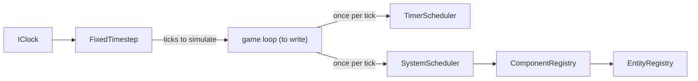

The engine is the generic part of the game: it stores game objects, advances time at a fixed rate and runs delayed work. It knows nothing about R-Type, SFML or sockets. The rules of the game live in `rtype_game`, which is built on top of it (see [Architecture](/R-Type/architecture/)).

This page tells you where to look when you need to change something. It describes what exists today and says plainly what does not exist yet.

| Part | State | Where |
|---|---|---|
| Entities | Available | `src/engine/EntityRegistry/`, `src/engine/Entity.hpp` |
| Components | Available | `src/engine/Components/` |
| Fixed timestep and timers | Available | `src/engine/Time/` |
| Systems and queries | Available | `src/engine/Systems/`, `ComponentRegistry::forEach` |
| Game loop | Not yet written: the pieces exist, nothing assembles them | — |
| Event bus | Not yet written | — |

## How the parts fit together



The client and the server will each own one loop. The engine provides the building blocks; the loop itself is added by a later story.

## ECS: entities and components

An **entity** is only a handle, `Entity { index, generation }` (`Entity.hpp`). It carries no data. A **component** is a plain struct or enum attached to an entity by type, for example `Position`, `Velocity`, `CollisionBox` and `EntityType` in `src/game/Components/`. `EntityType` says what an entity is: `Player`, `Enemy`, `PlayerMissile` or `EnemyMissile`. A missile records the side that fired it, because the rules must tell a player missile, which may only hit enemies, from an enemy missile, which may only hit players.

### Entities: `EntityRegistry`

`EntityRegistry` creates and destroys entities and recycles the index of a destroyed one. The generation tells apart the successive entities that lived in the same slot, so a handle kept after a destruction never matches the entity that took its place: `isAlive()` is false for it.

### Components: `ComponentRegistry`

`ComponentRegistry` owns one `ComponentStorage<T>` per component type and offers `add<T>`, `get<T>`, `has<T>` and `remove<T>`.

- `get<T>` returns a pointer, or `nullptr` when the component is absent or the entity is dead. The pointer is invalidated by a later `add` or `remove` of the same type.
- `add<T>` throws `DeadEntityException` on a dead entity and replaces a component of the same type.
- Entities must be destroyed through `ComponentRegistry::destroy`, never through `EntityRegistry` directly, otherwise their components stay behind.

Each `ComponentStorage<T>` keeps its components in one contiguous `std::vector<T>`, and an `EntityIndexMap` says where the component of a given entity index sits (a sparse set). Add, lookup and removal are constant time and the array has no gaps. The reasoning is in [Architecture](/R-Type/architecture/#components).

```cpp
rtype::engine::EntityRegistry entities;
rtype::engine::ComponentRegistry components(entities);

rtype::engine::Entity ship = entities.create();
components.add(ship, rtype::game::Position{.x = 100.0F, .y = 200.0F});

if (auto* position = components.get<rtype::game::Position>(ship)) {
  position->x += 1.0F;
}

components.destroy(ship);
```

## Systems and queries

A **system** is one behavior of the game: a class that implements `ISystem` (`src/engine/Systems/ISystem.hpp`) and reads or updates components in `update(components, elapsed)`.

`MovementSystem` (`rtype_game`, `src/game/Systems/MovementSystem/`) is the first system of the game. It moves every entity that has a `Position` and a `Velocity` by the velocity, in units per second, multiplied by `elapsed`, so the distance depends on simulation time and never on the frame rate. An entity without a `Velocity` stays in place, and nothing keeps an entity inside the playfield. No loop runs it yet.

### Queries: `ComponentRegistry::forEach`

`forEach<First, Second>(callback)` calls `callback(entity, first, second)` for every alive entity that has both a `First` and a `Second` component. It walks the storage of `First` and looks up `Second` for each entity. Entities are visited in no particular order, each at most once. The references given to the callback are only valid during that call. A query takes exactly two component types; to walk a single type, ask for it twice.

```cpp
components.forEach<rtype::game::Position, rtype::game::Velocity>(
    [](rtype::engine::Entity, rtype::game::Position& position,
       rtype::game::Velocity& velocity) {
      position.x += velocity.x;
    });
```

### Changing entities during a query

- `ComponentRegistry::destroy` called during a `forEach` is postponed until the outermost `forEach` returns. Until then the entity is still alive and readable, but it is no longer visited. Destroying the same entity twice, or through a stale handle, is harmless.
- `add<T>` and `remove<T>` during a `forEach` throw `ComponentChangeDuringIterationException`: adding reallocates a storage and removing moves its last component, either of which would corrupt the walk. A system that needs to change components collects the entities in the callback and changes them after `forEach` returns.

### Order: `SystemScheduler`

`SystemScheduler` runs systems in the order they were added with `add()`. The order never changes, so every `run(components, elapsed)` calls the systems in the same sequence. A system added later sees what the earlier ones did, including the entities they destroyed. `add()` must not be called from inside a system, and a null system throws `NullSystemException`.

## Game loop: time

The simulation runs at a fixed rate, `SIMULATION_TICKS_PER_SECOND` (60), whatever the rendering rate (`TimeConstants.hpp`).

- `IClock` is the source of time. `SystemClock` reads the real clock; tests use `tests/SimulatedClock.hpp`, so a test never waits and gives the same result at any frame rate.
- `FixedTimestep` turns the time read from an `IClock` into a whole number of ticks to simulate. The remainder is kept for the next call. A stall longer than `MAXIMUM_TICKS_PER_ADVANCE` ticks is dropped instead of being caught up.
- `TimerScheduler` runs a callback after a delay (`scheduleOnce`) or at a regular interval (`scheduleRepeating`), and cancels it through the `TimerHandle` it returned. It never reads a clock: the caller passes `SIMULATION_TICK_DURATION` to `advance()` once per tick.

The loop the client and the server will write looks like this:

```cpp
const std::size_t ticks = timestep.consumeTicks();
for (std::size_t tick = 0; tick < ticks; ++tick) {
  timers.advance(rtype::engine::SIMULATION_TICK_DURATION);
  systems.run(components, rtype::engine::SIMULATION_TICK_DURATION);
}
```

The loop itself does not exist yet: today only the pieces above are in `rtype_engine`, and `GameWindow` (`src/client/Window/GameWindow/`) does not use them.

## Event bus

There is no event bus in the code yet. This page will describe it, its folder and its classes when the story that adds it is merged. Until then, nothing in the engine publishes or subscribes to events.

## Where to intervene

| You want to… | Look at |
|---|---|
| Add a component type | A new struct in `src/game/Components/`; nothing to register, `ComponentRegistry` creates its storage on first use |
| Change how components are stored | `src/engine/Components/ComponentStorage.hpp`, `EntityIndexMap/` |
| Change how entities are created or recycled | `src/engine/EntityRegistry/` |
| Change the simulation rate | `SIMULATION_TICKS_PER_SECOND` in `src/engine/Time/TimeConstants.hpp` |
| Write a behavior that walks components | A class implementing `ISystem` in `src/engine/Systems/ISystem.hpp`, added to a `SystemScheduler` |
| Change how entities move | `MovementSystem` in `src/game/Systems/MovementSystem/` |
| Change the order systems run in | The order of the `SystemScheduler::add()` calls |
| Run something after a delay | `TimerScheduler` in `src/engine/Time/TimerScheduler/` |
| Add an engine error | `src/engine/Exceptions/EngineException.hpp` |
| Write a test that depends on time | `tests/SimulatedClock.hpp`, `tests/FixedTimestepTest.cpp` |

Each folder has its own `CMakeLists.txt` declaring one library, linked into `rtype_engine` by `src/engine/CMakeLists.txt`.
