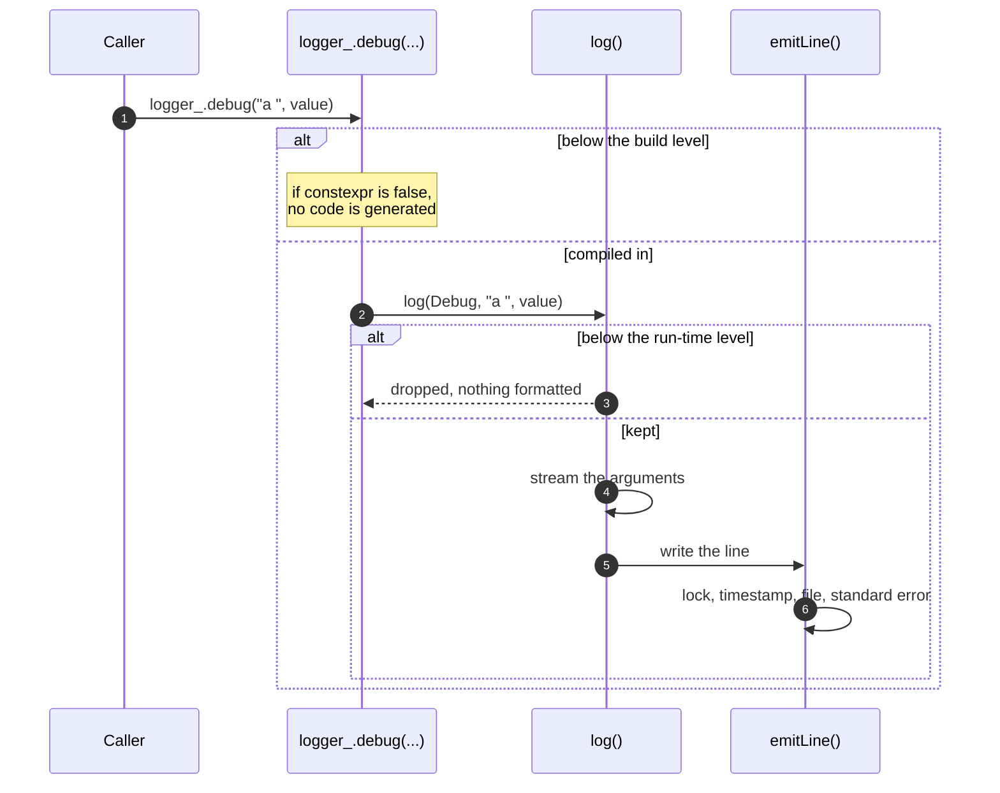

## Context

A network problem is diagnosed after the fact, from what the client and the server wrote down. Both programs therefore share one logger: every line is timestamped, carries a level and the name of the module that wrote it, and lines written by different threads never mix.

The logger comes from the raytracer project and lives in `src/logging/`, in the `rtype_logging` library. It depends on nothing else of the repository, so the engine, the game, the network, the client and the server can all use it.

## Line format

```
[2026-10-06T14:03:21.159Z] [INFO ] [Server] - server starting
```

The time is **UTC**, with the date, so the journals of two machines can be compared line by line. A line is the time, the level, the module, then the message.

When standard error is a terminal, its lines are colored by level. The file never contains color codes. Color is never used on Windows.

## Using the logger

Each module owns a `Logger` built with its name:

```cpp
#include "Logger.hpp"

class NetworkContext {
 private:
  rtype::logging::Logger logger_{"Network"};
};

logger_.info("listening on port ", port);
logger_.warn("dropped a packet of ", size, " bytes");
auto timer = logger_.scope("load assets");
```

The arguments of a call are written one after the other; any type that can be written to a `std::ostream` works. `scope("label")` returns a `ScopedTimer` that writes `label took 1.234 ms` when it is destroyed, at the `info` level unless another one is given as the second argument.

## Levels

| Level | Use it for |
|---|---|
| `trace` | very frequent events, such as one line per packet |
| `debug` | diagnostics for developers |
| `info` | significant events, such as starting and stopping |
| `warn` | something abnormal that does not stop the program |
| `error` | a failure |
| `silent` | no line at all |

The default level is `info`.

## Choosing the level and the output at launch

The client and the server read the same options:

| Option | Effect |
|---|---|
| `--log-level <name>` | The level: `trace`, `debug`, `info`, `warn`, `error` or `silent`, in any case. |
| `--log-file <path>` | The journal. The default is `r-type_server.log` or `r-type_client.log` in the current directory. |
| `--no-log-file` | No journal. |
| `--log-stderr` | Also write to standard error. |

The level can also come from the `RT_LOG_LEVEL` environment variable; `--log-level` wins over it. A value of `RT_LOG_LEVEL` that is not a level is ignored, while a `--log-level` that is not a level is an error.

The last of `--log-file` and `--no-log-file` wins. With `--no-log-file` and no `--log-stderr`, nothing is written. Arguments that do not start with `--log-` or `--no-log-` are ignored; a `--log-` option that does not exist is an error, so a typo is never silent.

The options are all read and checked before anything changes: with an invalid option, or a journal that cannot be opened, the program stops with a message and exit code 1.

The journal is opened in append mode, so a second launch keeps the lines of the first, and it is flushed after every line, so it is complete even if the program crashes. `NO_COLOR` or `RT_LOG_NO_COLOR` turns the color of standard error off.

```bash
./r-type_server --log-stderr --log-level debug
RT_LOG_LEVEL=warn ./r-type_client --log-file /tmp/client.log
```

## Two filters

**At build time**, the CMake option `LOG_LEVEL` sets the lowest level kept in the binaries. Each logging method is wrapped in `if constexpr`, so a call below that level produces no code. The default is `trace`: everything is compiled in, in every build type, so the level chosen at launch always takes effect.

```bash
cmake --preset default -DLOG_LEVEL=info
```

Lowering the level at launch below the build level has no effect, since those calls do not exist in the binary. The unit tests expect the default build level.

**At run time**, the level set at launch drops the calls that remain. The check comes **before** any formatting: a `debug` call at the `info` level does not format its arguments. The arguments themselves are still evaluated by the caller, so an expensive one is guarded with `Logger::shouldLog()`.



## Threads

A line is written under a single lock, and its timestamp is read under that lock, so the lines of a file are in the order of the clock and never interleave. The run-time level is an atomic. A test writes 200 lines from 4 threads and checks that every line is whole and that each one appears exactly once; with the lock removed, that test crashes.

## Cost

Measured on an Apple M5 with AppleClang 21 at `-O2`, local disk, one run of a throwaway program that is not part of the repository. The journal is flushed to the operating system after every line, not synchronised to the disk.

| Measure | Result |
|---|---|
| A `debug` call at the `info` level | 2.9 ns |
| An `info` line to the file, one thread | 2.5 µs |
| An `info` line to the file, 8 threads writing at once | 4.5 µs per line overall |

A server tick lasts 16.67 ms. One `info` line per tick takes 2.5 µs, which is 0.015 % of it. Give a `ScopedTimer` placed in the tick loop the `debug` level, as in `logger_.scope("tick", rtype::logging::LogLevel::Debug)`: at the default `info` level it would write a line on every tick.

These numbers say nothing about Windows or GCC.
