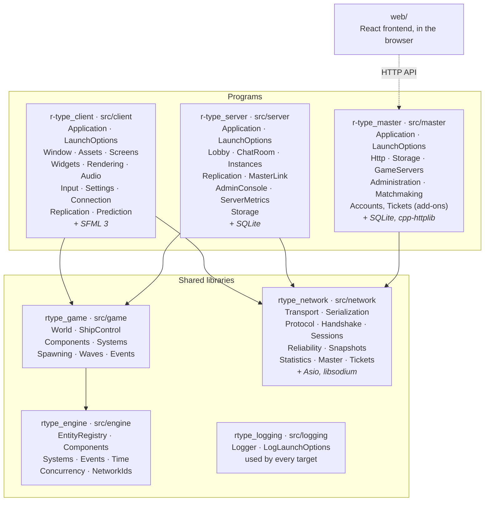
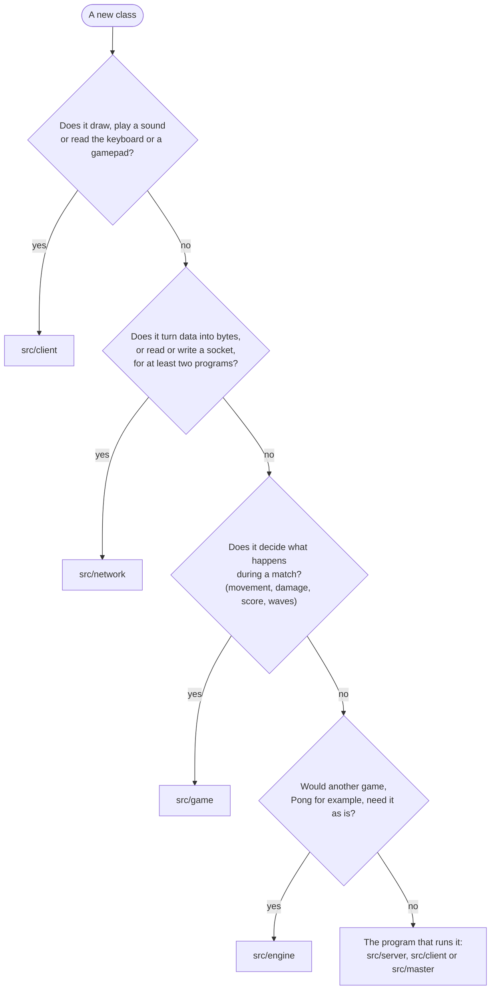
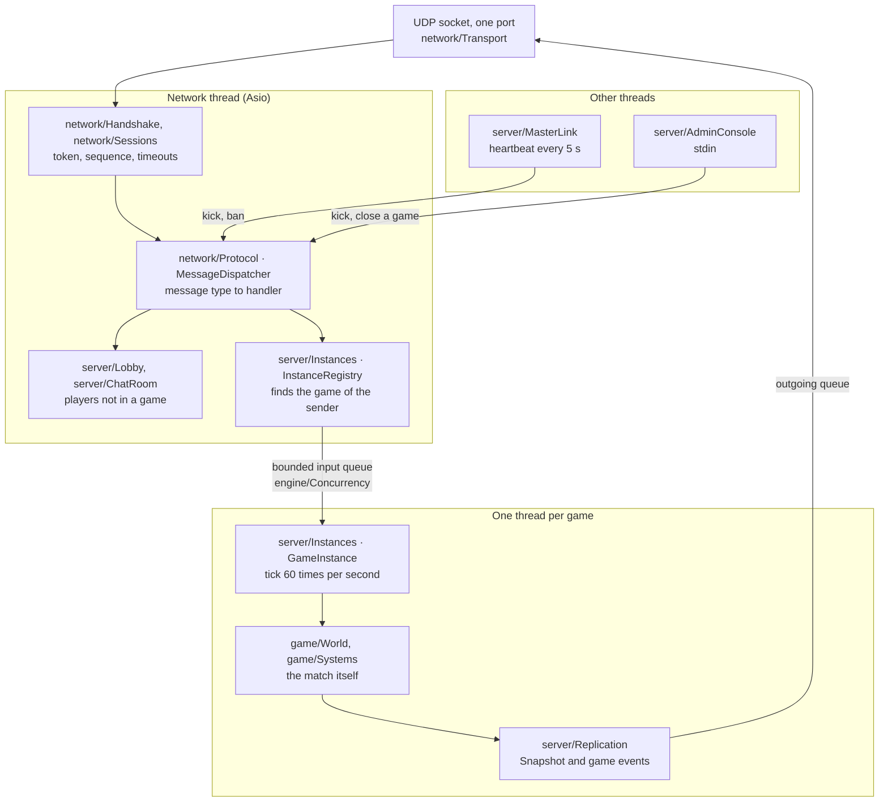
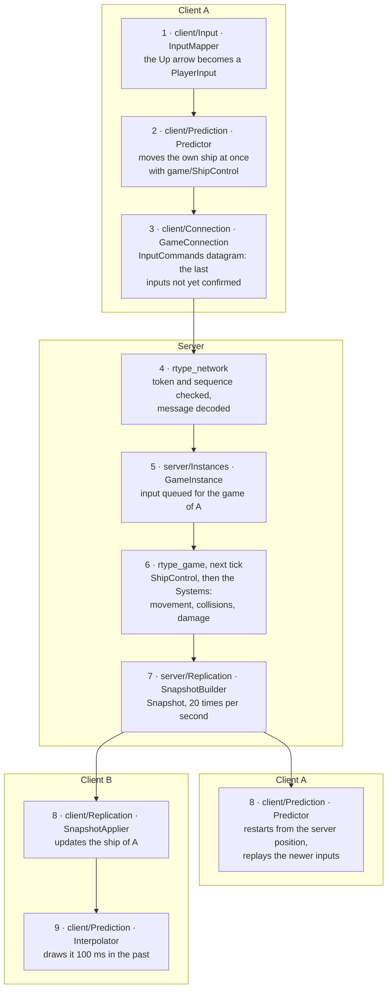
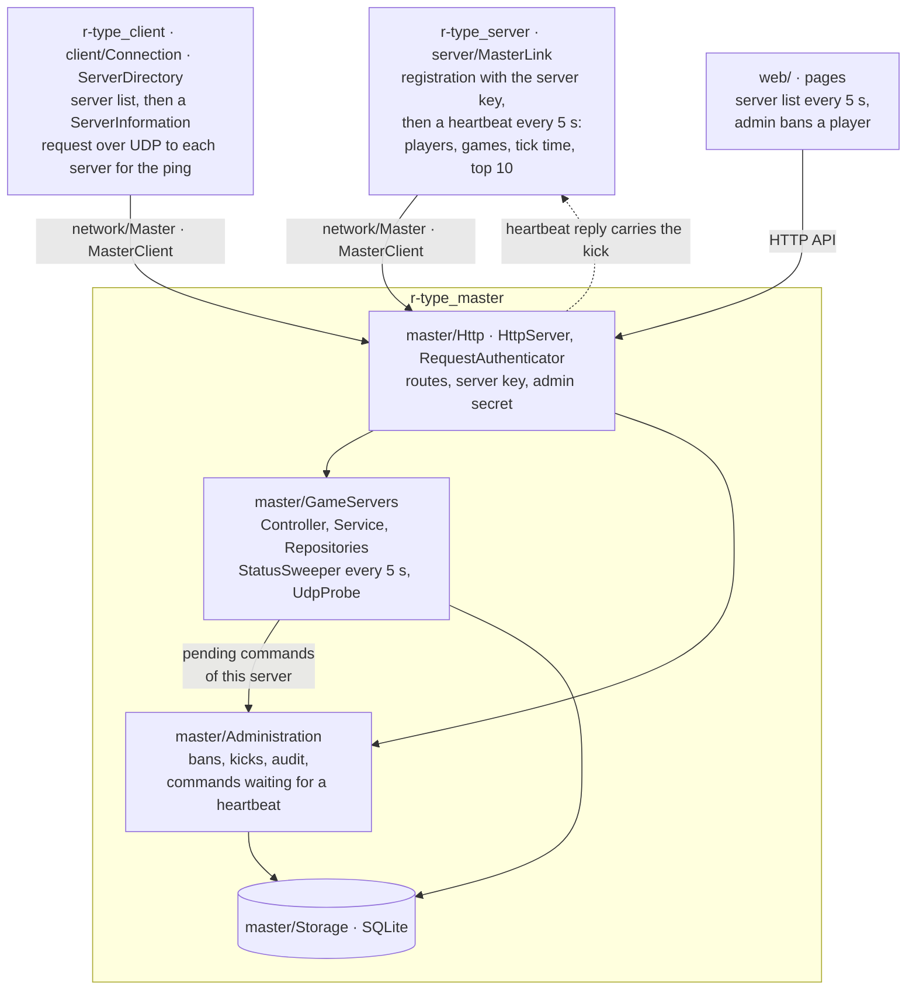

The repository builds three programs (`r-type_client`, `r-type_server` and, in part 2, `r-type_master`) on four libraries (`rtype_engine`, `rtype_game`, `rtype_network`, `rtype_logging`). Part 2 adds a master server, a web frontend, several games per server and the anti-lag techniques: most of the classes of the project do not exist yet and will be written by several people at the same time.

This page gives each of them a home before it is written: which library or program it belongs to, the folder it goes in, how the file and its CMake target are named, and where its test goes. The reasons behind the split itself are in [Architecture](/R-Type/architecture/).

**How to read it.** Every folder carries a status:

| Status | Meaning |
|---|---|
| exists | on `main` today |
| in progress | its story is being written now |
| to create | the agreed home of code that does not exist yet |
| to move | exists, but not where the conventions put it (see [Moves](#moves-from-todays-code)) |
| add-on | optional feature: nothing in the base game depends on it |

Class names under "to create" are the expected ones. The story that writes a class may rename it, and updates this page in the same pull request.

## The big picture



Solid arrows are links; a program reaches `rtype_engine` through `rtype_game`. Every library and program may link `rtype_logging`, so its arrows are left out. The dotted arrow from `web/` is a call at run time, not a link. Third-party libraries are in italics.

| Target | Role | May link | Never links |
|---|---|---|---|
| `rtype_engine` | Generic mechanisms any game needs: entities, components, systems, events, time, queues between threads | `rtype_logging` | SFML, Asio, `rtype_game`, `rtype_network`, client code |
| `rtype_game` | What happens during a match: R-Type components, systems, waves, ship control | `rtype_engine`, `rtype_logging` | SFML, Asio, `rtype_network`, client code |
| `rtype_network` | Everything that crosses the wire: UDP, sessions, reliability, the message contract, the master contract | Asio, libsodium, `rtype_logging`; cpp-httplib and nlohmann-json if the master is reached over HTTP | SFML, `rtype_engine`, `rtype_game`, client code |
| `rtype_logging` | Timestamped log lines, shared by everything | standard library only | everything else |
| `r-type_client` | Screens, rendering, sound, input, connection, prediction | `rtype_game`, `rtype_network`, `rtype_logging`, SFML | server or master code |
| `r-type_server` | Lobby, games running in parallel, replication, link with the master, console | `rtype_game`, `rtype_network`, `rtype_logging`, SQLite | SFML, client code |
| `r-type_master` | List of game servers and their status, administration, HTTP API, serves `web/` | `rtype_network`, `rtype_logging`, SQLite, cpp-httplib, nlohmann-json | SFML, `rtype_game`, client code |

`rtype_logging` is a library of its own because `rtype_network` must not link `rtype_engine`, and both need to write log lines. The forbidden links are checked at configure time by `rtype_forbid_links` in the root `CMakeLists.txt`.

## Which library?



Two consequences:

- **The rules of a match live in `src/game`, even the ones only the server runs.** `src/server` decides who plays where and how the state reaches the players; `src/game` decides what happens in the match. A system can then be tested by stepping a `World`, without a thread or a socket.
- **A class that only one program uses stays in that program**, even if it talks to the network: the server's link with the master is `src/server/MasterLink`, built on the contract in `src/network/Master`.

## Conventions for a new file

| What you add | Where | Example in the code |
|---|---|---|
| A concrete class `Foo` | Its own folder: `<module>/Foo/` holding `Foo.hpp`, `Foo.cpp` and `CMakeLists.txt`, nothing else | `src/engine/Time/SystemClock/` |
| An interface (`IFoo`), an abstract class, a plain struct with no `.cpp`, a constants header | The parent folder | `Time/IClock.hpp`, `Time/TimerHandle.hpp`, `game/Components/Position.hpp` |
| A literal with a meaning (port, rate, size, timeout) | `<Concept>Constants.hpp` in the folder of the concept | `Time/TimeConstants.hpp`, `game/PlayfieldConstants.hpp` |
| An error | A subclass of the root exception in `<owner>/Exceptions/<Owner>Exception.hpp`, never a raw `throw std::` | `DeadEntityException` in `engine/Exceptions/EngineException.hpp` |
| A namespace | One per library or program | `rtype::engine`, `rtype::game`, `rtype::network`, `rtype::client`; to come: `rtype::logging`, `rtype::server`, `rtype::master` |
| The CMake target of a class folder | A library named after the class: `rtype_<owner>_<class_in_snake_case>` | `rtype_engine_system_clock` |
| The CMake target of a folder without a class | An `INTERFACE` library named after the folder, exposing its headers | `rtype_engine_time`, `rtype_game_components` |
| The CMake target of a library | An `INTERFACE` aggregate `rtype_<owner>` that links every target below it | `rtype_engine` |
| The classes of a program | Class targets `rtype_<program>_<class>`, linked by the executable and by its tests | `rtype_client_window` (to rename, see [Moves](#moves-from-todays-code)) |
| A test | `tests/<owner>/<Module>/FooTest.cpp`, added to the `<owner>_tests` executable | `tests/engine/Time/TimerSchedulerTest.cpp` (today at the root of `tests/`) |
| A test double (fake clock, fake transport) | `tests/doubles/` | `SimulatedClock.hpp` (today at the root of `tests/`) |

Every folder has its own `CMakeLists.txt`, and its parent adds it with `add_subdirectory`. Every new target calls `rtype_enable_warnings()`. File names are the `PascalCase` name of the class they hold.

### What comes from our previous projects

| Pattern | Raytracer | Zappy | R-Type |
|---|---|---|---|
| Shared code in libraries, one aggregate target | One static library per module, aggregated by `raytracer_src` | `common/`: one static library per folder (`zappy_protocol`, `zappy_schema`, `zappy_cli`...), linked by `zappy_server` and `zappy_gui`, no aggregate | `rtype_engine`, `rtype_game`, `rtype_network`, `rtype_logging`, each with an aggregate target |
| Interface in the domain folder, implementations below it | `components/Primitives/IObject.hpp`, `Primitives/sphere/Sphere.cpp` | `gui/Network/INetworkClient.hpp` | `Time/IClock.hpp`, `Time/SystemClock/` |
| One message contract read by both ends | none | `common/Protocol` (`AiProtocol`, `GuiProtocol`), `common/Rpc/Message` | `src/network/Protocol`, `src/network/Master` |
| Bounded reading of incoming data | none | `common/Schema/Fields` (`BoundedNumberFieldType`) | `src/network/Serialization/BitReader` |
| An application folder and a command-line folder per program | `application/Application`, `application/ArgsParser` | `server/App/GameServer`, `server/Cli/ArgsParser`, `gui/App/Application` | `<program>/Application`, `<program>/LaunchOptions` |
| Exceptions per domain | `ImageException`, `MaterialException`, `SceneParseException` | `gui/Exceptions/GuiException`, `HandshakeException` | `<owner>/Exceptions/<Owner>Exception.hpp` |
| One logger per module | `common/helper/Logger` | none | `src/logging/Logger`, ported from the raytracer |
| Tests that mirror the sources | `tests/components/Primitives/SphereTest.cpp` | `tests/Gui/`, `tests/Net/` | `tests/<owner>/<Module>/` |
| Test doubles apart | `tests/fixtures/` | `tests/Gui/mocks/FakeNetwork` | `tests/doubles/` |
| Not kept | Lowercase folders (`sphere/`, `cone/`) | Several classes in one folder (`server/App/World/`) | `PascalCase` folders, one folder per class |

## The folders

### Repository root

```
r-type/
├── CMakeLists.txt         options, warnings, rtype_forbid_links, format and tidy targets
├── CMakePresets.json
├── vcpkg.json, vcpkg/     pinned dependencies
├── src/
│   ├── engine/            rtype_engine                exists
│   ├── logging/           rtype_logging               in progress
│   ├── game/              rtype_game                  exists
│   ├── network/           rtype_network               exists
│   ├── client/            r-type_client               exists
│   ├── server/            r-type_server               exists
│   └── master/            r-type_master               to create
├── tests/                 GoogleTest, one executable per library or program
├── assets/                files read at run time      to create
├── web/                   web frontend                to create
├── docs/                  this site
└── .github/workflows/     build-and-test, docs
```

### `src/engine`: `rtype_engine`

```
src/engine/
├── CMakeLists.txt              rtype_engine, aggregate                         exists
├── Entity.hpp                  entity handle: index and generation             exists
├── EntityRegistry/             creates, destroys, recycles entities            exists
├── Components/                 IComponentStorage.hpp                           exists
│   ├── ComponentStorage.hpp    contiguous storage of one component type        to move
│   ├── ComponentRegistry/      add, get, has, remove by type                   exists
│   └── EntityIndexMap/         sparse set: entity index to position            exists
├── Systems/                    ISystem.hpp                                     in progress
│   └── SystemScheduler/        runs the systems in a fixed order, queries
│                               "entities with A and B", deferred destruction
├── Events/                                                                     in progress
│   └── EventBus/               typed publish and subscribe
├── Time/                       IClock.hpp, TimeConstants.hpp, TimerHandle.hpp  exists
│   ├── FixedTimestep/          wall time to a whole number of ticks            exists
│   ├── SystemClock/            the real clock                                  exists
│   └── TimerScheduler/         callbacks after a delay or at an interval       exists
├── Concurrency/                                                                to create
│   └── BoundedQueue/           hands messages from one thread to another
├── NetworkIds/                                                                 to create
│   └── NetworkIdRegistry/      entity to network id and back, on both sides
└── Exceptions/                 EngineException.hpp                             exists
```

The engine never names an R-Type concept: no Bydo, no missile, no score. `NetworkIds` holds integers, not sockets: the client and the server both need to find a local entity from the id the server gave it.

### `src/logging`: `rtype_logging`

```
src/logging/                                                                    in progress
├── LoggingConstants.hpp
├── Logger/                     one instance per module, thread-safe lines
├── LogLaunchOptions/           log level and outputs read at launch
└── Exceptions/                 LoggingException.hpp
```

### `src/game`: `rtype_game`

```
src/game/
├── CMakeLists.txt              rtype_game                                      exists
├── PlayfieldConstants.hpp      size of the logical playfield                   exists
├── PlayerInput.hpp             the actions a player can press, 8 bits          to create
├── InstanceRules.hpp           difficulty, lives, friendly fire, max players,
│                               assisted mode, with their bounds                to create
├── World.hpp, World.cpp        the state of one match                          to move into World/
├── ShipControl/                applies a PlayerInput to a ship: run by the
│                               server tick and by the client prediction        to create
├── Components/                 Position, Velocity, CollisionBox                exists
│                               to come: entity type, Health, Faction, Weapon,
│                               Projectile, ScoreValue, PlayerSlot, Lives
├── Systems/                                                                    to create
│   ├── MovementSystem/         moves entities by their velocity                in progress
│   ├── CollisionSystem/        publishes a collision event
│   ├── DamageSystem/           collision between factions: health, destruction
│   ├── ShootingSystem/         player and enemy weapons, fire rate
│   ├── EnemyBehaviourSystem/   Bydo movement patterns
│   ├── LivesSystem/            death, respawn, elimination
│   ├── ScoreSystem/
│   ├── PowerUpSystem/          bonuses dropped and picked up
│   └── EndOfGameSystem/        last wave cleared, or every ship dead
├── Spawning/                                                                   to create
│   └── EntitySpawner/          creates a ship, a Bydo, a missile, a bonus
│                               with its components
├── Waves/                                                                      to create
│   └── WaveDirector/           when and which enemies appear, harder over time
├── Events/                     one struct per game event: collision,           to create
│                               entity destroyed, player left, score changed
└── Exceptions/                 GameException.hpp                               to create
```

The only game code the client runs is `ShipControl` (prediction of its own ship) and the components it reads to draw. Everything else runs in the server's game instances.

### `src/network`: `rtype_network`

```
src/network/
├── CMakeLists.txt              rtype_network                                   exists
├── NetworkConstants.hpp        protocol id, version, 1200-byte datagrams,
│                               default port, timeouts                          to create
├── NetworkContext.hpp, .cpp    the Asio event loop                             to move into NetworkContext/
├── Transport/                  IDatagramTransport.hpp                          to create
│   ├── UdpTransport/           Asio UDP socket, for client, server and master
│   └── ConditionSimulator/     adds latency, loss, duplicates and reordering
│                               in front of a transport
├── Serialization/                                                              to create
│   ├── BitWriter/
│   └── BitReader/              every read checks the bytes left first
├── Protocol/                   PacketHeader.hpp, MessageType.hpp               to create
│   ├── Messages/               one struct per message: ConnectRequest.hpp,
│   │                           InputCommands.hpp, Snapshot.hpp,
│   │                           ServerInformation.hpp...
│   ├── MessageCodec/           message to bytes and back, bounds checked
│   └── MessageDispatcher/      message type to the typed handler a program
│                               registered
├── Handshake/                                                                  to create
│   ├── ChallengeCookie/        stateless cookie: MAC of address and time
│   ├── ConnectionGuard/        rate limit per address, temporary bans, version
│   └── ClientHandshake/        client side: request, challenge, token
├── Sessions/                                                                   to create
│   ├── Session/                one peer: token, sequences, acks, channels, ping
│   └── SessionRegistry/        sessions by address and token, timeouts,
│                               reconnection window
├── Reliability/                                                                to create
│   ├── AckTracker/             sequence numbers and the 32 acknowledgement bits
│   ├── ReliableChannel/        resends until acknowledged, delivers in order
│   └── Fragmenter/             splits and reassembles large messages
├── Snapshots/                  EntityState.hpp: net id, type, quantized
│                               position, health                                to create
│   ├── SnapshotHistory/        snapshots sent, baseline of each client
│   └── DeltaEncoder/           entity states compared with a baseline
├── Statistics/                                                                 to create
│   └── TrafficCounters/        bytes, datagrams, rejected packets, per direction
├── Master/                     contract with r-type_master                     to create
│   ├── Messages/               one struct per message: registration,
│   │                           heartbeat, server list entry, admin command
│   └── MasterClient/           registers, sends heartbeats, fetches the list
├── Tickets/                    Ticket.hpp                                      add-on
│   └── TicketSigner/           signs and verifies a join ticket
└── Exceptions/                 NetworkException.hpp                            to create
```

Messages carry plain data (ids, quantized positions, health), never a component: the network does not know the ECS. The server and the client translate between components and messages, in their `Replication` folders.

### `src/server`: `r-type_server`

```
src/server/
├── main.cpp                    entry point                                     exists
├── CMakeLists.txt              r-type_server                                   exists
├── Application/                starts and stops the threads: network,
│                               instances, master link, console                 to create
├── LaunchOptions/              port, name, max instances, tick and snapshot
│                               rates, timeouts, master address                 to create
├── Lobby/                      players connected but not in a game: list,
│                               create, join, leave, quick play                 to create
├── ChatRoom/                   lobby and game chat, bounded length and rate    to create
├── Instances/                  InstanceState.hpp: waiting, countdown,
│                               playing, finished, closed, crashed              to create
│   ├── InstanceRegistry/       creates and closes games, max_instances, finds
│   │                           the game of a player
│   ├── GameInstance/           one game: its thread, World, tick, input queue;
│   │                           catches its own exceptions
│   └── PositionHistory/        past positions for lag compensation
├── Replication/                                                                to create
│   ├── SnapshotBuilder/        World to Snapshot, at the snapshot rate
│   └── GameEventBroadcaster/   game events to reliable messages
├── MasterLink/                 registration, heartbeat every 5 s, applies the
│                               admin commands of the reply                     to create
├── AdminConsole/               commands read on stdin: list, kick, close       to create
├── ServerMetrics/              atomic counters: tick time, players, traffic    to create
├── Storage/                                                                    to create
│   ├── ServerDatabase/         the SQLite file of this server
│   ├── LeaderboardRepository/
│   ├── PlayerStatisticsRepository/
│   └── BanRepository/          bans of this server only                        add-on
└── Exceptions/                 ServerException.hpp                             to create
```

### `src/client`: `r-type_client`

```
src/client/
├── main.cpp                                                                    exists
├── CMakeLists.txt              r-type_client                                   exists
├── Application/                owns the frame loop (today GameWindow::run),
│                               the screen stack and the network threads        to create
├── LaunchOptions/              address and port for a direct connection        to create
├── Window/                     WindowConstants.hpp                             exists
│   └── GameWindow/             the SFML window, scaling of the playfield       to move
├── Assets/                                                                     to create
│   └── AssetCache/             textures, sounds, fonts loaded once, by id
├── Screens/                    IScreen.hpp                                     to create
│   ├── ScreenStack/
│   ├── HomeScreen/             guest nickname
│   ├── ServerListScreen/       servers from the master, with ping
│   ├── ConnectScreen/          direct connection by address
│   ├── LobbyScreen/            games of a server, chat
│   ├── CreateInstanceScreen/
│   ├── WaitingRoomScreen/      players, colors, Ready
│   ├── GameScreen/
│   ├── EndScreen/              scores
│   ├── OptionsScreen/
│   ├── HelpScreen/
│   └── LeaderboardScreen/
├── Widgets/                    Button/, TextField/, ListView/, Slider/,
│                               ChatPanel/, Notice/                             to create
├── Rendering/                                                                  to create
│   ├── SpriteRenderer/         draws entities, scaled from the playfield
│   ├── SpriteAnimator/
│   ├── Starfield/              scrolling background
│   ├── Hud/                    lives, score, players
│   ├── ParticleEffects/        explosions, hits
│   └── Lagometer/              ping curve, losses
├── Audio/                                                                      to create
│   ├── SoundPlayer/
│   └── MusicPlayer/
├── Input/                                                                      to create
│   └── InputMapper/            keyboard and gamepad to PlayerInput,
│                               remapping, auto fire
├── Settings/                   UserSettings.hpp: volumes, key bindings,
│                               color blind mode, interface size, reduced
│                               effects                                         to create
│   └── SettingsFile/           loads and saves the settings
├── Connection/                                                                 to create
│   ├── GameConnection/         session with a server on the network thread,
│   │                           queues to the frame loop
│   └── ServerDirectory/        list from the master and ping of each server,
│                               on a background thread
├── Replication/                                                                to create
│   └── SnapshotApplier/        creates, updates, destroys local entities
│                               by network id
├── Prediction/                                                                 to create
│   ├── Predictor/              own ship: applied at once, reconciled
│   ├── Interpolator/           other entities, shown 100 ms in the past
│   └── ServerClock/            estimate of the server time
└── Exceptions/                 ClientException.hpp                             to create
```

The frame loop never waits: the network and HTTP threads hand their results over through queues that the loop drains once per frame.

### `src/master`: `r-type_master`

```
src/master/                                                                     to create
├── main.cpp
├── CMakeLists.txt              r-type_master
├── Application/                starts the HTTP server, the status sweeper and
│                               the probe
├── LaunchOptions/              port, database path, web folder; the admin
│                               secret comes from the environment
├── Http/
│   ├── HttpServer/             routes under /api, serves web/ under /
│   └── RequestAuthenticator/   server key or admin secret
├── Storage/
│   ├── Database/               SQLite connection, transactions
│   ├── MigrationRunner/
│   └── migrations/             numbered .sql files
├── GameServers/
│   ├── GameServerController/   register, heartbeat, list, detail, history
│   ├── GameServerService/
│   ├── GameServerRepository/
│   ├── ServerSampleRepository/ one sample every 5 s, kept 7 days
│   ├── LeaderboardRepository/  last top 10 received from each server
│   ├── StatusSweeper/          recomputes the five statuses every 5 s
│   └── UdpProbe/               ServerInformation request to each server
├── Administration/
│   ├── AdministrationController/
│   ├── AdministrationService/  server keys, maintenance, bans, kicks
│   ├── BanRepository/
│   ├── PendingCommandRepository/
│   │                           commands sent with the next heartbeat reply
│   └── AuditRepository/
├── Matchmaking/
│   └── MatchmakingService/     quick play: picks a server
├── Accounts/                   AccountController/, AccountService/,
│                               AccountRepository/, SessionRepository/,
│                               PasswordHasher/                                 add-on
├── Tickets/
│   └── TicketService/          issues join tickets (format in rtype_network)   add-on
└── Exceptions/                 MasterException.hpp
```

Each module of the master splits its classes by role:

| Role | Does | Never |
|---|---|---|
| Controller | Reads the HTTP request, validates it, calls a service, returns JSON | SQL, a business rule |
| Service | Applies the rules, calls its own repositories and the services of other modules | The repository of another module |
| Repository | The only place with SQL, prepared statements only | Calls a service |
| Record (plain struct, parent folder) | Data, no behaviour | Logic |

### `tests`

```
tests/
├── CMakeLists.txt              rtype_add_test: one executable per library or
│                               program (engine_tests, game_tests...)           exists
├── doubles/                    SimulatedClock.hpp (today at tests/),
│                               FakeTransport (loses, duplicates, reorders,
│                               delays datagrams)                               to create
├── engine/                     mirrors src/engine: Time/TimerSchedulerTest.cpp to move
├── logging/                                                                    in progress
├── game/                                                                       to move
├── network/                    including malformed and truncated packets       to move
├── server/                                                                     to create
├── client/                     logic only: prediction, input, replication;
│                               no test opens a window                          to create
├── master/                                                                     to create
└── tools/
    └── LoadTestClient/         bots replaying scripted inputs for the
                                measurements; built with the tests, never
                                shipped                                         to create
```

### `web`, `assets`, `docs`

```
web/                            React, Vite, TypeScript; built by the CI and    to create
│                               served by r-type_master
├── package.json, vite.config.ts
└── src/
    ├── api/                    one typed function per master route
    ├── pages/                  ServersPage, ServerDetailPage,
    │                           LeaderboardPage, admin/
    ├── components/             StatusChip, ServerTable, StatusTimeline,
    │                           MetricChart
    └── hooks/                  usePolling

assets/                         every file read at run time                     to create
├── sprites/  sounds/  music/  fonts/    read by the client
└── waves/                      read by the server, once waves are described
                                in files

docs/src/content/docs/          one page per topic: architecture, engine,
                                project layout; to come: logging, client,
                                server, network, protocol RFC, master API
```

## Threads of the server



A piece of data has one owner thread. The network thread owns the sessions and the lobby, each game thread owns its `World`, and threads only talk through bounded queues: the simulation takes no lock.

## A key press, folder by folder

Player A holds the Up arrow; player B sees A's ship move.



## The master, folder by folder

A server joins the list, a player browses it, an admin bans a player.



## Where does this code go?

| I want to… | Folder |
|---|---|
| **Engine and logging** | |
| Store a new kind of data on entities | A struct in `src/game/Components/`; `ComponentRegistry` creates its storage on first use |
| Walk every entity that has A and B, in a fixed order | A system in `src/game/Systems/`, scheduled by `src/engine/Systems/` |
| Let two systems talk without including each other | An event struct in `src/game/Events/`, published on `src/engine/Events/EventBus/` |
| Run something after a delay | `src/engine/Time/TimerScheduler/` |
| Hand data from one thread to another | `src/engine/Concurrency/BoundedQueue/` |
| Write a log line | A `Logger` of `src/logging/`, one per module |
| **Game** | |
| Move the ship with the arrows | `src/game/ShipControl/`, used by the server and by the client prediction |
| Detect that a missile touches a Bydo | `src/game/Systems/CollisionSystem/` publishes a collision event |
| Decide that the Bydo loses health or explodes | `src/game/Systems/DamageSystem/` |
| Spawn Bydos, harder wave after wave | `src/game/Waves/WaveDirector/` |
| Create a ship, a Bydo, a missile with its components | `src/game/Spawning/EntitySpawner/` |
| Add a rule chosen when a game is created | `src/game/InstanceRules.hpp`, checked by `src/server/Lobby/` |
| **Network** | |
| Add a message to the protocol | A struct in `src/network/Protocol/Messages/`, its id in `MessageType.hpp`, its encoding in `MessageCodec/`, then the protocol RFC |
| Read a value from a received datagram | `src/network/Serialization/BitReader/`, never a cast on the buffer |
| Make a message arrive, in order | `src/network/Reliability/ReliableChannel/` |
| Refuse a client that floods connection requests | `src/network/Handshake/ConnectionGuard/` |
| Notice a client that stopped sending | `src/network/Sessions/SessionRegistry/` |
| Simulate 150 ms of lag and 5 % loss | `src/network/Transport/ConditionSimulator/` |
| Count the bytes per second | `src/network/Statistics/TrafficCounters/` |
| Send only what changed since the last acknowledged snapshot | `src/network/Snapshots/DeltaEncoder/` |
| **Server** | |
| Run several games at once | `src/server/Instances/` |
| Start a game when everyone is ready | `src/server/Instances/GameInstance/` |
| List, create, join a game | `src/server/Lobby/` |
| Send the world to the players | `src/server/Replication/SnapshotBuilder/` |
| Tell the master the server is alive | `src/server/MasterLink/` |
| Kick a player from the server terminal | `src/server/AdminConsole/` |
| Keep this server's leaderboard | `src/server/Storage/LeaderboardRepository/` |
| Add a launch option | `src/server/LaunchOptions/`, default value in a constants header |
| **Client** | |
| Add a screen | `src/client/Screens/<Name>Screen/`, implementing `IScreen` |
| Add a button or a text field | `src/client/Widgets/` |
| Load a texture once and share it | `src/client/Assets/AssetCache/`, file in `assets/sprites/` |
| Remap the keys, play with a gamepad | `src/client/Input/InputMapper/`, saved by `src/client/Settings/` |
| Volume, color blind mode, interface size | `src/client/Settings/UserSettings.hpp`, applied by `Audio/` and `Rendering/` |
| Starfield, HUD, explosions, lagometer | `src/client/Rendering/` |
| Show the own ship at once and the others smoothly | `src/client/Prediction/` |
| Apply the world received from the server | `src/client/Replication/SnapshotApplier/` |
| Show the server list with ping | `src/client/Connection/ServerDirectory/` and `Screens/ServerListScreen/` |
| **Master and web** | |
| Add an HTTP route | The controller of its module in `src/master/<Module>/`; SQL only in a repository |
| Add a table | A numbered `.sql` file in `src/master/Storage/migrations/` |
| Compute the status of the servers | `src/master/GameServers/StatusSweeper/` |
| Ban a player on every server | `src/master/Administration/` |
| Add a page to the web frontend | `web/src/pages/`, its call in `web/src/api/` |
| **Tests** | |
| A network that loses and reorders datagrams | `tests/doubles/` |
| Bots for the load measurements | `tests/tools/LoadTestClient/` |

## Moves from today's code

These files predate the conventions above. Each move changes no behaviour and goes in its own `refactor` pull request.

| Today | Target | Why |
|---|---|---|
| `src/game/World.hpp`, `World.cpp` | `src/game/World/`, target `rtype_game_world` | A concrete class has its own folder |
| `src/network/NetworkContext.hpp`, `.cpp` | `src/network/NetworkContext/` | Same |
| `src/client/Window/GameWindow.hpp`, `.cpp`, target `rtype_client_window` | `src/client/Window/GameWindow/`, target `rtype_client_game_window` | Same, and the target is named after the class |
| `src/engine/Components/ComponentStorage.hpp` | `src/engine/Components/ComponentStorage/`, `INTERFACE` target | A class template is still a concrete class |
| `tests/*.cpp` | `tests/<owner>/<Module>/` | Tests mirror the sources |
| `tests/SimulatedClock.hpp` | `tests/doubles/` | Test doubles in one place |
| `rtype_forbid_links` reads the direct links of a target only | Walk the links recursively | A class library inside `rtype_engine` that links SFML passes the check today |

## Not decided yet

- **Transport between the programs and the master: HTTP or UDP.** The folders do not change: only the inside of `src/network/Master/MasterClient/`, and whether `rtype_network` links cpp-httplib and nlohmann-json. The browser talks HTTP to the master in both cases.
- **Track 1 (engine as a separate project, resources, scripting).** It would add folders to `src/engine` (resources, scripting) and move generic components out of `src/game`. Nothing here depends on it.
