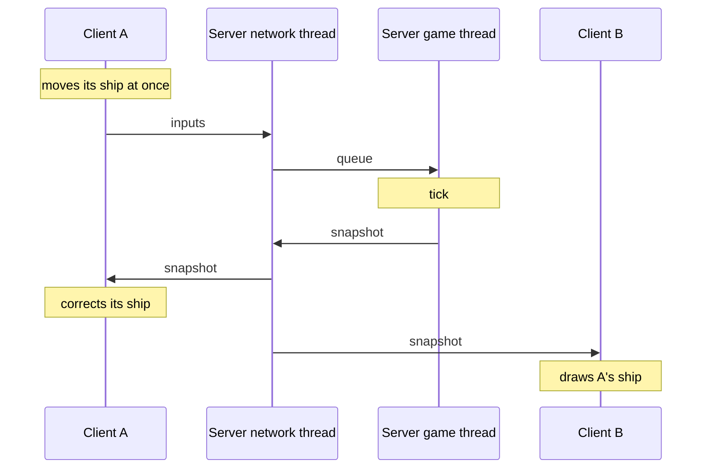

This page answers one question: **where does the code I am about to write go?** It is a map of the repository, not an inventory. It names the libraries, the programs and their main folders, says what each one holds and what it must never hold, and shows how to add a class. Why the code is split this way is explained in [Architecture](/R-Type/architecture/).

Most folders below do not exist yet. Each section says which ones do; the story that creates a folder may adjust what is inside, and updates this page in the same pull request.

## Who may link what

The repository builds three programs on four libraries. Programs link libraries, never the reverse. Between libraries, the only links are `rtype_game` to `rtype_engine`, and any library to `rtype_logging`.

| Target | Holds | Never links |
|---|---|---|
| `r-type_client` | what the player sees, hears and presses | server or master code |
| `r-type_server` | the lobby, the games running in parallel, the link with the master | SFML, Asio |
| `r-type_master` | the list of game servers, their status, administration, the HTTP API | SFML, `rtype_game` |
| `rtype_game` | what happens during a match | SFML, Asio, `rtype_network` |
| `rtype_network` | everything that crosses the wire | SFML, `rtype_engine`, `rtype_game` |
| `rtype_engine` | the building blocks any game needs | SFML, Asio, `rtype_game`, `rtype_network` |
| `rtype_logging` | log lines; every other target may link it | anything else |

`rtype_logging` stands alone because `rtype_network` may not link `rtype_engine` and both write logs. A forbidden link fails the CMake configure step (`rtype_forbid_links` in the root `CMakeLists.txt`).

## Where does a new class go?

Ask the questions in order. The first "yes" decides.

| | Question | If yes |
|---|---|---|
| 1 | Does it draw, play a sound or read the keyboard or a gamepad? | `src/client` |
| 2 | Is it a message two programs exchange, or code that encodes or transports messages? | `src/network` |
| 3 | Does it decide what happens during a match: movement, damage, score, waves? | `src/game` |
| 4 | Would any other game need it unchanged? | `src/engine` |
| 5 | None of the above | the program that runs it: `src/server`, `src/client` or `src/master` |

The cases where people hesitate:

| Code | Goes in | Because |
|---|---|---|
| Moving the ship from the player's input | `src/game/ShipControl` | the server runs it, and the client runs the same code to predict its own ship |
| Damage after a collision | `src/game/Systems` | it is a rule of the match, even though only the server runs it |
| A queue between two threads | `src/engine/Concurrency` | the client and the server both need it, and it knows nothing about R-Type |
| Finding an entity from its network id | `src/engine/NetworkIds` | `rtype_network` may not know entities |
| The heartbeat sent to the master | `src/server/MasterLink` | only the server sends it; the message format lives in `src/network/Master` |
| A new protocol message | `src/network/Protocol` | one struct per message, its encoding next to it, then a row in [Protocol](/R-Type/protocol/#messages) |
| A fake transport that loses datagrams | `tests/doubles` | test doubles are never built into a program |

## The libraries

### Engine

`src/engine` builds `rtype_engine`, the building blocks of a networked game, R-Type or not. **Never** an R-Type word (Bydo, missile, score), never SFML or Asio.

```
src/engine/
├── EntityRegistry/   creates and recycles entities
├── Components/       stores components by type
├── Systems/          runs systems in a fixed order
├── Events/           typed event bus
├── Time/             fixed timestep, clocks, timers
├── Concurrency/      queues between threads
├── NetworkIds/       entity to network id, and back
└── Exceptions/
```

`EntityRegistry`, `Components`, `Systems`, `Events`, `Time`, `Concurrency` and `Exceptions` exist; `NetworkIds` is not written yet.

### Logging

`src/logging` builds `rtype_logging`: one `Logger` per module, writing timestamped lines to the terminal and to a file, with the level chosen at launch. It links nothing else of the repository. It is being written, with `Logger/` and `LogLaunchOptions/`.

### Game

`src/game` builds `rtype_game`, the rules of a match: what moves, what collides, what dies, what scores. The server runs all of it; the client only runs `ShipControl`, to predict its own ship. **Never** SFML, Asio or a network message.

```
src/game/
├── World/            the state of one match
├── ShipControl/      applies a player's input to their ship
├── Components/       Position, Velocity, CollisionBox, Health...
├── Systems/          movement, collisions, damage, shooting, score, lives
├── Spawning/         creates ships, enemies, missiles, bonuses
├── Waves/            when and which enemies appear
└── Events/           collision, entity destroyed, player left...
```

`World`, `Components` and the movement system (`Systems/MovementSystem/`) exist; the other systems and folders are not written yet.

### Network

`src/network` builds `rtype_network`: everything that crosses the wire, for the client, the server and the master. **Never** a component: messages carry plain data (ids, quantized positions, health), and the client and the server translate between messages and entities in their own `Replication` folders.

```
src/network/
├── NetworkContext/   the Asio event loop
├── Transport/        UDP socket, lag and loss simulator
├── Serialization/    bit reader and writer, every read bounded
├── Protocol/         one struct per message, encoding, dispatch by type
├── Handshake/        challenge, rate limit, version check
├── Sessions/         session token, sequence numbers, timeouts
├── Reliability/      acknowledgements, ordered channel, fragments
├── Snapshots/        history and delta encoding of the world state
├── Statistics/       bytes and packets counted per direction
├── Master/           messages and client of the master
└── Exceptions/
```

`NetworkContext`, `Transport` (the UDP socket, not the simulator), `Serialization` and `Exceptions` exist; see [Network](/R-Type/network/).

## The programs

### Server

`src/server` builds `r-type_server`: who plays where, and how the state reaches them. Every game runs on its own thread and owns its `World`; the network thread owns the sessions and the lobby; threads only talk through queues.

```
src/server/
├── Application/      starts and stops the threads
├── LaunchOptions/    port, name, limits, master address
├── Lobby/            players not in a game: list, create, join, chat
├── Instances/        one GameInstance per game, each on its thread
├── Replication/      world to snapshots and game events
├── MasterLink/       registration and heartbeat
├── AdminConsole/     kick and close a game from the terminal
├── Metrics/          tick time and traffic, sent in the heartbeat
└── Storage/          this server's SQLite file: leaderboard, statistics
```

Only `main.cpp` exists today.

### Client

`src/client` builds `r-type_client`: what the player sees, hears and presses. The frame loop never waits: the network and HTTP threads hand their results over through queues.

```
src/client/
├── Application/      frame loop and screen stack
├── Window/           the SFML window
├── Assets/           assets found by id, loaded per screen in a loading step
├── Platform/         what differs between Windows, macOS and Linux
├── Screens/          home, server list, lobby, game, end, options...
├── Widgets/          buttons, text fields, lists
├── Rendering/        sprites, starfield, HUD, effects, lagometer
├── Audio/            sounds and music
├── Input/            keyboard and gamepad to player input, remapping
├── Settings/         volumes, key bindings, accessibility, saved to disk
├── Connection/       session with a server, server list from the master
├── Replication/      applies snapshots to the local entities
└── Prediction/       own ship predicted, other ships interpolated
```

`Window`, `Rendering`, `Assets` and `Platform` exist today.

`Rendering` draws every entity that has a `Position` and a `Sprite` (an asset id and a layer), from the background layer to the interface layer. `RenderSystem` reads these two components and nothing else, and draws through `IDrawSurface`; only `SfmlDrawSurface` knows SFML, and it finds textures through `ITextureSource`. The system is not wired into the frame loop yet.

`Rendering/Background` draws the scrolling starfield behind the playfield, and the frame loop already draws it. It is described in [Client](/R-Type/client/#scrolling-background-scrollingbackground).

### Master

`src/master` builds `r-type_master`, the directory of game servers: it records their heartbeats, computes their status, runs administration and serves the web frontend. Game servers send a heartbeat every 5 seconds and receive admin commands in the reply. Like the other programs, it has `Application/` and `LaunchOptions/`.

```
src/master/
├── Http/             routes, server key and admin secret check
├── Storage/          SQLite connection and migrations
├── GameServers/      registration, heartbeats, status, top 10 of each server
├── Administration/   bans, kicks, maintenance, audit log
├── Matchmaking/      quick play
└── Accounts/         optional, with Tickets/
```

Each module splits its classes into a controller (HTTP in and out), a service (the rules) and repositories (the only place with SQL). Nothing exists yet.

### Tests, web frontend, assets

- **`tests/`** mirrors `src/`: the test of `src/game/Waves/WaveDirector` is `tests/game/Waves/WaveDirectorTest.cpp`, built into `game_tests`, one executable per library or program. Test doubles (fake clock, lossy transport) go in `tests/doubles/`; load-test bots in `tests/tools/`, never shipped. Today the older tests sit at the root of `tests/`; `tests/client/` and `tests/engine/Concurrency/` already follow this layout.
- **`web/`** is the React frontend served by the master: `src/api/` (one function per route), `src/pages/`, `src/components/`.
- **`assets/`** holds the files read at run time: `sprites/`, `sounds/`, `music/` and `fonts/` for the client, `waves/` for the server.

## Adding a class

Adding `WaveDirector` to `src/game/Waves`:

```
src/game/Waves/
├── CMakeLists.txt         add_subdirectory(WaveDirector)
└── WaveDirector/
    ├── CMakeLists.txt     add_library(rtype_game_wave_director STATIC WaveDirector.cpp)
    ├── WaveDirector.hpp
    └── WaveDirector.cpp
```

- A concrete class has its own folder, named after it, holding only its `.hpp`, its `.cpp` and its `CMakeLists.txt`.
- Interfaces (`IWaveSource`), plain structs and constants headers (`WaveConstants.hpp`) stay in the parent folder.
- The class library is `rtype_<owner>_<class_in_snake_case>`, linked by the aggregate of its library (`rtype_game`) or by its program.
- The namespace is `rtype::<owner>`: `rtype::game` here.
- An error is a subclass of the owner's root exception, in `<owner>/Exceptions/`: `GameException` here.

This follows our previous projects: shared code in libraries and one folder per program, like Zappy; one library per module, interfaces next to their implementations and tests that mirror the sources, like the Raytracer. Two things differ: folders are `PascalCase`, and a folder holds one class.

## A key press, from one screen to another

Player A holds the Up arrow and player B sees A's ship move. Each step happens in one place.



| In the diagram | What happens | Where |
|---|---|---|
| moves its ship at once | The key becomes a player input; the ship moves without waiting for the server | `client/Input`, `client/Prediction`, `game/ShipControl` |
| inputs | The last inputs not yet confirmed are sent | `client/Connection`, `network/Protocol` |
| queue | Token and sequence checked, input queued for A's game | `network/Sessions`, `server/Instances` |
| tick | Ship control, then the systems | `game/ShipControl`, `game/Systems` |
| snapshot | The world is sent to every player, 20 times per second | `server/Replication`, `network/Snapshots` |
| corrects its ship | A restarts from the server position and replays its newer inputs | `client/Prediction` |
| draws A's ship | B shows A's ship 100 ms in the past, between two snapshots | `client/Replication`, `client/Prediction` |

## Moves from today's code

A few files predate these conventions. Each move is a `refactor` pull request that changes no behavior.

| Today | Target |
|---|---|
| `src/game/World.cpp` | `src/game/World/` |
| `src/engine/Components/ComponentStorage.hpp` | `src/engine/Components/ComponentStorage/` |
| `tests/*.cpp`, `tests/SimulatedClock.hpp` | `tests/<owner>/<Module>/`, `tests/doubles/` |

`rtype_forbid_links` also reads only the direct links of a target: a class library inside `rtype_engine` that linked SFML would pass. It must walk the links recursively.

## Not decided yet

- **HTTP or UDP between the programs and the master.** Only the inside of `src/network/Master` changes.
- **Track 1** (the engine as its own project, scripting). It would add folders to `src/engine`; nothing on this page depends on it.
