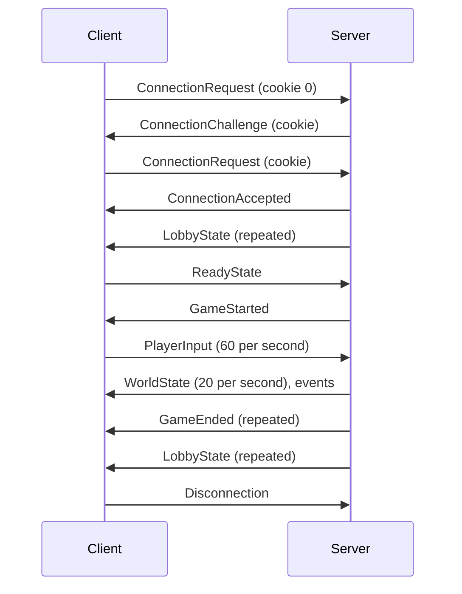

import ByteLayout from '../../components/ByteLayout.astro';

The client and the server talk over UDP in the binary format described on this page, byte by byte, so each side can be written without reading the code of the other. Version 0 is the contract for the first part of the project. Only the transport limit is in the code so far: the socket in `src/network/Transport` drops a datagram over 1200 bytes (see [Network](/R-Type/network/)). `src/network/Serialization` and `src/network/Protocol`, where the rest will live, do not exist yet (see [Project layout](/R-Type/project-layout/#network)).

## Transport

- Every message of the game travels over UDP; no TCP connection is opened.
- The server listens on one port. The client sends from any port, and the server answers to the address and port the datagram came from.
- A datagram carries at most 1200 bytes of UDP payload. Every IPv6 link carries packets of 1280 bytes or more (RFC 8200, section 5); minus the 40-byte IPv6 header and the 8-byte UDP header, that leaves 1232 bytes, so 1200 keeps room for 32 bytes of IPv6 extension headers. QUIC relies on the same figure and expects it to pass on all IPv6 paths and on modern IPv4 paths (RFC 9000, section 14). A path with a smaller MTU, such as some VPNs and tunnels, may still fragment or drop a datagram; version 0 does not detect it.
- A datagram is read on its own: no message is split across two datagrams.

## Encoding

Each field is written and read one at a time, never copied from memory as a struct, so neither padding nor the byte order of the machine reaches the wire. Integers are big-endian, the order the IP and UDP headers use for their own fields, so a number reads in a capture the way it is written: `protocolId` shows as `52 54 59 50`.

| Type | Size | Encoding |
|---|---|---|
| `u8`, `u16`, `u32`, `u64` | 1, 2, 4, 8 bytes | unsigned, big-endian (most significant byte first) |
| `bool` | 1 byte | 0 is false, 1 is true, any other value is invalid |
| `position` | 4 bytes | x then y, each a signed 16-bit integer (two's complement, big-endian) counting eighths of a logical unit |
| `string` | 1 + n bytes | length `u8`, then n bytes of UTF-8, no terminator |
| enumeration | 1 byte | `u8`; a value not listed on this page is invalid |

### Positions

A position is in logical units, in the frame described in [Architecture](/R-Type/architecture/#coordinate-system). Each coordinate is rounded to the nearest eighth of a unit: 8 on the wire is 1 unit, -8 is -1 unit. The range is -4096 to 4095.875 units and the rounding error is at most 0.0625 unit; every multiple of an eighth survives the round trip through a `float` exactly.

- The range holds the playfield plus one playfield size beyond each edge as long as `PLAYFIELD_WIDTH` and `PLAYFIELD_HEIGHT` stay at or below 2047 units. The code must check this at compile time, so enlarging the playfield breaks the build instead of sending positions to the opposite edge.
- The server must destroy an entity before it leaves the range: a coordinate outside it is a bug, never clamped to the edge.

## Datagram

A datagram is a 22-byte header followed by one or more messages. The header, byte by byte: the blue fields are used in version 0, the gray ones are written as 0 until the second part of the project.

<ByteLayout
  label="The 22-byte header: protocolId on bytes 0 to 3, version on byte 4, flags on byte 5, sessionToken on bytes 6 to 13, sequence on bytes 14 and 15, acknowledgedSequence on bytes 16 and 17, acknowledgementBits on bytes 18 to 21."
  rows={[
    {
      fields: [
        { name: 'protocolId', bytes: 4, tone: 'blue' },
        { name: 'version', bytes: 1, tone: 'blue' },
        { name: 'flags', bytes: 1, tone: 'gray' },
        { name: 'sessionToken', bytes: 8, tone: 'blue' },
      ],
    },
    {
      fields: [
        { name: 'sequence', bytes: 2, tone: 'blue' },
        { name: 'acknowledgedSequence', bytes: 2, tone: 'gray' },
        { name: 'acknowledgementBits', bytes: 4, tone: 'gray' },
      ],
    },
  ]}
/>

| Offset | Size | Field | In version 0 |
|---|---|---|---|
| 0 | 4 | `protocolId` | `0x52545950`, `RTYP` in ASCII |
| 4 | 1 | `version` | 0 |
| 5 | 1 | `flags` | 0 |
| 6 | 8 | `sessionToken` | 0 until the connection is accepted, then the token given by the server |
| 14 | 2 | `sequence` | number of the datagram for its sender |
| 16 | 2 | `acknowledgedSequence` | 0 |
| 18 | 4 | `acknowledgementBits` | 0 |

Each message is a type (`u8`), the size of its payload in bytes (`u16`, the 3 bytes of type and size excluded), then the payload. A sender of version 0 puts one message per datagram; a receiver accepts several.

- `protocolId` and `version` stay at offsets 0 and 4 in every future version, so a receiver tells which version sent a datagram from its first 5 bytes.
- `sessionToken` is drawn at random by the server when it accepts a connection, never 0. The server writes it in every datagram it sends to that client, and the client copies it into every datagram it sends afterward. Within a session, each side drops and counts a datagram that carries another token, so nobody can steer a ship, or feed a client false states, by forging an address. A `ConnectionRequest` carries 0, since the client has no token yet: it never keeps a session alive, and it only gets a player slot with a valid cookie (see [Connection](#connection)).
- `sequence` counts the datagrams a side sends to the other: one counter per peer, starting at 0 with the first datagram to that peer, growing by 1 and wrapping from 65535 to 0. Within a session, a receiver drops a datagram that is not newer than the newest one it has accepted from that peer, so a late or duplicated datagram never undoes a newer one. Newer means ahead by 1 to 32767 modulo 65536 (serial number arithmetic, RFC 1982), so the comparison survives the wrap. Datagrams sent before a session exists (`ConnectionChallenge`, `ConnectionRefused`) carry 0 and are not compared.
- `flags`, `acknowledgedSequence` and `acknowledgementBits` are written as 0 and ignored in version 0.

The header reserves the fields of the second part of the project now, so dropping duplicates and guaranteeing messages later moves no field of any datagram. It costs 17 bytes per datagram more than a 5-byte header: about 11 kbit/s per client at 60 inputs and 20 states per second.

Alternative considered: a 5-byte header (`protocolId`, `version`) and a version 1 that adds the rest. It is smaller, but the token checked from version 0 needs its 8 bytes anyway, and adding the sequence and the acknowledgements in the middle of the project changes the layout of every datagram (they are planned in `Sessions` and `Reliability`, see [Project layout](/R-Type/project-layout/#network)).

### Receiving a datagram

A received datagram goes through these checks in order. No buffer is sized from a field before that field has been checked against the bytes actually received, and every rejection is logged with its sender, at a bounded rate.

| Check | If it fails |
|---|---|
| The datagram holds 25 to 1200 bytes | dropped |
| `protocolId` is `RTYP` | dropped |
| `version` is 0 | dropped; the server answers an unknown sender with `ConnectionRefused` (`IncompatibleVersion`) if the datagram holds at least 26 bytes |
| `flags` is 0 | dropped |
| The message sizes add up exactly to the end of the datagram | dropped |
| The sender is known, or the datagram holds a `ConnectionRequest` | dropped |
| Within a session, `sessionToken` is the token of the session (a `ConnectionRequest` may carry 0) | dropped and counted |
| Within a session, `sequence` is newer than the newest one accepted from that peer | dropped |
| The message type is listed below | that message is skipped, the next one is read |
| The payload has the size its type requires and every value is in range | that message is dropped |

The token is checked before the sequence, so a forged datagram never moves the counter. The server never sends an unknown sender more bytes than the datagram it answers, so a forged source address cannot turn it into an amplifier: a `ConnectionRequest` holds at least 35 bytes, and every answer to it at most 33 (`ConnectionChallenge`). A client that receives a datagram of another version decodes nothing in it, and reports both version numbers to the player: its own, and the one at offset 4.

## Messages

The type identifies a message in both directions: `Disconnection` and `Heartbeat` appear in both tables with the same number.

### Client to server

| Type | Message | Payload | Sent |
|---|---|---|---|
| 1 | `ConnectionRequest` | `cookie` `u64` (0 until the server gives one), `nickname` `string` (1 to 16 bytes) | every 500 ms until an answer; the client gives up after 5 s |
| 4 | `Disconnection` | none | when the player closes the client, three times 50 ms apart |
| 5 | `Heartbeat` | none | after 1 s without sending anything else |
| 6 | `ReadyState` | `ready` `bool` | when the player changes it, and again while `LobbyState` shows another value |
| 9 | `PlayerInput` | `inputNumber` `u32`, `actions` `u8` | 60 times per second during a game |

### Server to client

| Type | Message | Payload | Sent |
|---|---|---|---|
| 2 | `ConnectionAccepted` | `playerNumber` `u8` (1 to 4) | in answer to a request; its header carries the session token |
| 3 | `ConnectionRefused` | `reason` `u8`: 1 `GameFull`, 2 `GameInProgress`, 3 `IncompatibleVersion` | in answer to a request |
| 4 | `Disconnection` | none | when the server shuts down, three times 50 ms apart |
| 5 | `Heartbeat` | none | after 1 s without sending anything else |
| 7 | `LobbyState` | `playerCount` `u8`, then per player `playerNumber` `u8`, `ready` `bool`, `nickname` `string` | on every change, and at least every 500 ms while no game runs |
| 8 | `GameStarted` | none | when every connected player is ready |
| 10 | `WorldState` | see [World state](#world-state) | 20 times per second during a game |
| 11 | `EntitySpawned` | `entityId` `u32`, `entityType` `u8`, `position` | when an entity appears |
| 12 | `EntityDestroyed` | `entityId` `u32`, `reason` `u8`: 1 `Killed` (explosion), 2 `Removed` (no effect) | when an entity disappears, three times 50 ms apart |
| 13 | `GameEvent` | `eventNumber` `u16`, `kind` `u8`, `playerNumber` `u8`, `entityId` `u32` | see [Game events](#game-events), three times 50 ms apart |
| 14 | `PlayerLeft` | `playerNumber` `u8`, `reason` `u8`: 1 `Left`, 2 `TimedOut` | to the other players, when one leaves or times out, three times 50 ms apart |
| 15 | `GameEnded` | `playerCount` `u8`, then per player `playerNumber` `u8`, `score` `u32` | when no player has a life left, then every 500 ms until the server waits for players again |
| 16 | `ConnectionChallenge` | `cookie` `u64` | in answer to a request without a valid cookie |

### Connection

A connection takes two round trips, so that a forged address never gets a player slot. The client sends `ConnectionRequest` with `cookie` 0; the server answers `ConnectionChallenge` with a cookie and keeps nothing. The client sends its request again with that cookie, and only then does the server give a slot and a token. The cookie only reaches the real owner of the address, so whoever forges the address cannot send it back. A request with a wrong or expired cookie gets a new challenge; a refusal (`GameFull`, `GameInProgress`, `IncompatibleVersion`) may be sent at once, since it reserves nothing.

How the server computes the cookie is its own business, as long as it keeps nothing per request and nobody can guess it: a keyed hash of the address, the port and the current 10-second window, with a secret drawn when the server starts, accepted during its window and the next one, does both.

A player keeps the number given by `ConnectionAccepted` until it leaves; the number also picks the color of the player, so no color travels. The nickname travels only in `ConnectionRequest` and `LobbyState`, never during a game. Its limit is 16 bytes, not 16 characters: a letter without accent takes 1 byte, an accented letter 2 and some symbols up to 4, so each accent leaves room for one letter less. The text field of the client counts bytes and refuses a character that would not fit whole; the server drops a request whose nickname is empty, longer than 16 bytes or not valid UTF-8. The server answers a `ConnectionRequest` with a valid cookie from a sender it already accepted with the same `ConnectionAccepted` again, same number and same token.

### Inputs

`actions` holds one bit per action, bit 0 being the least significant: 0 up, 1 down, 2 left, 3 right, 4 shoot. Bits 5 to 7 are 0, otherwise the message is invalid. A `PlayerInput` is sent even when no key is held (`actions` is 0). `inputNumber` starts at 1 and grows by 1 for each `PlayerInput` sent. The server keeps, for each player, the input with the highest `inputNumber`, applies it at every tick until a newer one arrives, and ignores an older one that arrives late.

### World state

`WorldState` lists every player and every entity of the game, in full each time. The payload of a state with one player and one entity, byte by byte:

<ByteLayout
  label="A WorldState with one player and one entity: tick on bytes 0 to 3, playerCount on byte 4, the player on bytes 5 to 15 (playerNumber, shipEntityId, lives, score, invulnerable), entityCount on byte 16, the entity on bytes 17 to 25 (entityId, entityType, x, y)."
  rows={[
    {
      fields: [
        { name: 'tick', bytes: 4, tone: 'purple' },
        { name: 'playerCount', bytes: 1, tone: 'gray' },
      ],
    },
    {
      fields: [
        { name: 'playerNumber', bytes: 1, tone: 'blue' },
        { name: 'shipEntityId', bytes: 4, tone: 'blue' },
        { name: 'lives', bytes: 1, tone: 'blue' },
        { name: 'score', bytes: 4, tone: 'blue' },
        { name: 'invulnerable', bytes: 1, tone: 'blue' },
      ],
      note: 'One player, repeated playerCount times.',
    },
    {
      fields: [{ name: 'entityCount', bytes: 1, tone: 'gray' }],
    },
    {
      fields: [
        { name: 'entityId', bytes: 4, tone: 'green' },
        { name: 'entityType', bytes: 1, tone: 'green' },
        { name: 'x', bytes: 2, tone: 'green' },
        { name: 'y', bytes: 2, tone: 'green' },
      ],
      note: 'One entity, repeated entityCount times.',
    },
  ]}
/>

| Field | Type |
|---|---|
| `tick` | `u32`, the simulation tick of the server, counted from the start of the game |
| `playerCount` | `u8` (1 to 4) |
| each player | `playerNumber` `u8`, `shipEntityId` `u32` (0 while the player has no ship), `lives` `u8`, `score` `u32`, `invulnerable` `bool` |
| `entityCount` | `u8` |
| each entity | `entityId` `u32`, `entityType` `u8`, `position` |

An entity takes 9 bytes, so one datagram holds up to 125 entities with 4 players. When the entities do not fit, the server sends several `WorldState` with the same `tick`, each in its own datagram, each with every player and a part of the entities. The client:

- ignores a `WorldState` whose `tick` is lower than the last one applied; an equal `tick` is another part of the same state;
- creates an entity it does not know, from its type, with its appearance effect (the shot sound of a missile, for instance);
- removes an entity that no `WorldState` has listed for 900 ms, so a ghost never stays a full second.

An `EntityDestroyed` naming an entity the client does not know, and an `EntitySpawned` naming one it already has, change nothing.

`entityId` is given by the server, unique during a game, and never 0. A `u16` would wrap after about 22 minutes at 50 new entities per second, hence 32 bits.

| `entityType` | Entity |
|---|---|
| 1 | `PlayerShip` |
| 2 | `PlayerMissile` |
| 3 | `Bydo` |
| 4 | `EnemyMissile` |

An entity of unknown type is skipped. New kinds of entities are added to this table as the game gets them.

### Game events

A `GameEvent` drives sounds and effects on the client, never a game rule. `eventNumber` starts at 1 for each game and grows by 1 for each event, wrapping from 65535 to 0; the three copies of an event carry the same number.

| `kind` | Event | `playerNumber` | `entityId` |
|---|---|---|---|
| 1 | `EntityDamaged`: hit, still alive | 0 | the entity |
| 2 | `PlayerHit`: the player lost a life | the player | 0 |
| 3 | `PlayerEliminated`: no life left, the player now watches | the player | 0 |

An `EntityDamaged` naming an entity the client does not know changes nothing. The explosion of a ship that is hit comes from its `EntityDestroyed` (`Killed`).

## A session

The messages of one session, from the connection to the end of a game:

In each phase the server repeats one message, and the client shows the screen of the last one it received, so a lost transition never leaves it on the wrong screen.

| Phase | Repeated message | The client shows |
|---|---|---|
| Waiting for players | `LobbyState`, every 500 ms | the lobby |
| Game in progress | `WorldState`, 20 per second | the game |
| Game ended | `GameEnded`, every 500 ms | the end screen |

Each side sends a `Heartbeat` after 1 s without sending anything else; any datagram that passes the checks above proves its sender is alive. The server closes a session after 5 s without a datagram carrying its token, removes the ship and sends `PlayerLeft` (`TimedOut`) to the others. The client shows that the connection is lost after 5 s without a datagram from the server. A `Disconnection` frees the place at once, and the others get `PlayerLeft` (`Left`).

## Losses

Nothing is guaranteed in version 0: a lost message is never resent on request. The state messages are repeated, so most losses correct themselves.

`EntityDestroyed`, `GameEvent`, `PlayerLeft` and `Disconnection` change the screen once and no state message repeats what they show, so each of them is sent three times, 50 ms apart. A copy that arrives after the first changes nothing: the entity is already gone, a `PlayerLeft` naming a player the client no longer lists is ignored, a `Disconnection` from a session already closed comes from an unknown sender, and the client handles each `eventNumber` once (remembering the numbers of the last second is enough). With 5 % of datagrams lost independently, one such message in 8000 is lost for good.

| Lost message | Corrected by | Within |
|---|---|---|
| `ConnectionRequest`, or its answer | the client sends the request again, the server answers it again | 500 ms |
| `ReadyState` | sent again while `LobbyState` shows another value | 500 ms |
| `LobbyState`, `GameEnded` | the next one | 500 ms |
| `WorldState` | the next one | 50 ms |
| `GameStarted` | the first `WorldState` | 50 ms |
| `PlayerInput` | the next input | 17 ms |
| `Heartbeat` | the next datagram | 1 s |
| `EntitySpawned` | the next `WorldState` creates the entity, with its appearance effect | 50 ms |
| `EntityDestroyed`, `GameEvent`, `PlayerLeft`, `Disconnection` | the next copy | 50 ms |
| all three copies of `Disconnection` | the session times out: the others get `PlayerLeft` (`TimedOut`) instead of (`Left`) | 5 s |
| all three copies of `EntityDestroyed` | the entity is removed once no `WorldState` has listed it for 900 ms, without explosion | 900 ms |
| all three copies of `GameEvent` or `PlayerLeft` | not corrected: the sound, effect or message on screen is missed; lives, scores and players stay right through the state messages | — |

The rates and delays on this page (60 inputs and 20 states per second, 500 ms, 900 ms, 1 s, 5 s, the 10-second cookie window) are **provisional**: they will be revised once measured on a real network. Code must name each of them as a constant and never repeat the number.

## Version 1

The second part of the project changes the protocol as follows:

- Each side measures the loss rate of the other from the gaps in `sequence`: nothing changes on the wire.
- Guaranteed messages use `flags`, `acknowledgedSequence` and `acknowledgementBits` and replace the three copies: same layout, new meaning, so `version` becomes 1.
- Several messages share a datagram: receivers of version 0 already accept it.
- `PlayerInput` repeats the inputs not yet confirmed, `WorldState` confirms the last input applied to each player, and states are sent as differences from the last one received: these payloads change in version 1.

A client and a server of different versions never play together: the connection is refused with `IncompatibleVersion`.

## Validation

| Team | Status |
|---|---|
| Team 1 | pending |
| Team 2 | pending |
| Team 3 | pending |
| Team 4 | pending |
